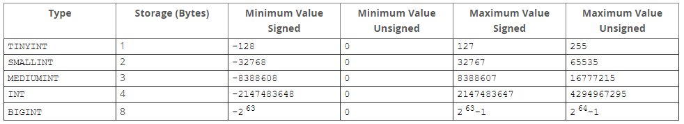
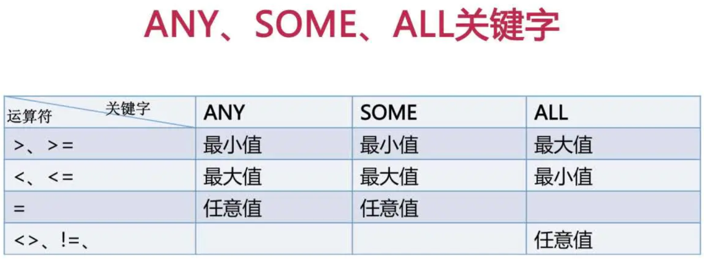
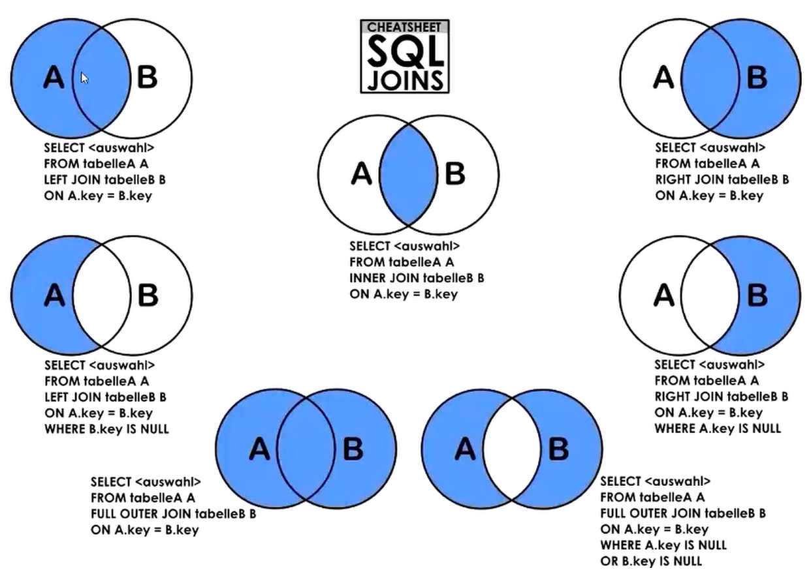

<!--
 * @Date: 2019-10-24 11:12:53
 * @Author: YING
 * @LastEditTime : 2020-02-11 15:10:49
 -->

# MYSQL学习记录

## 数据库操作

```mysql
# 新建数据库
CREATE DATABASE [IF NOT EXISTS] db_name;

# 示例
CREATE DATABASE IF NOT EXISTS school;

------------------------------------------------------------------------------------
# 查看数据库
SHOW DATABASES;

# 查看当前数据库
SELECT DATABASE();
------------------------------------------------------------------------------------
# 进入数据库
USE db_name；

------------------------------------------------------------------------------------
# 删除数据库
DROP DATABASE db_name
```

## 表格操作

### 创建表格

```mysql
# 新建表格
CREATE DATABASE [IF NOT EXISTS] db_name;

# 示例
CREATE TABLE IF NOT EXISTS students(
    id SMALLINT UNSIGNED AUTO_INCREMENT PRIMARY KEY, -- 序号，主键：每表唯一，非空
    userid INT UNSIGNED,    -- 学号
    username VARCHAR(20) NOT NULL,   -- 姓名
    age TINYINT UNSIGNED,   -- 年龄
    gender ENUM('0','1') DEFAULT '0',   -- 性别,默认女性
    class INT UNSIGNED   -- 班级
);

CREATE TABLE IF NOT EXISTS scores(
    id SMALLINT UNSIGNED AUTO_INCREMENT PRIMARY KEY, -- 序号
    userid INT UNSIGNED,    -- 学号
    course VARCHAR(50) NOT NULL,   -- 课程
    score TINYINT UNSIGNED   -- 分数
);
```

```mysql
# 复制表格结构体
CREATE DATABASE [IF NOT EXISTS] db_name LIKE db;

# 示例
CREATE TABLE IF NOT EXISTS copy_students(
LIKE students;

-----------------------------------------------

# 复制表格结构体 + 数据
CREATE DATABASE [IF NOT EXISTS] db_name 
AS SELECT * FROM db;

# 示例
CREATE TABLE IF NOT EXISTS copy_students(
AS SELECT * FROM students;
```



### 查看表格

```mysql
# 查看库里面所有表格
SHOW TABLES [FROM db_name];

# 示例
SHOW TABLES FROM school；
--->
+───────────────────+
| Tables_in_school  |
+───────────────────+
| scores            |
| students          |
+───────────────────+

------------------------------------------------------------------------------------
# 查看当前表的数据结构
SHOW COLUMNS FROM tb_name;
或者
DESC tb_name;

# 示例
DESC students;
--->
+───────────+───────────────────────+───────+──────+──────────+─────────────────+
| Field     | Type                  | Null  | Key  | Default  | Extra           |
+───────────+───────────────────────+───────+──────+──────────+─────────────────+
| id        | smallint(5) unsigned  | NO    | PRI  |          | auto_increment  |
| userid    | int(10) unsigned      | YES   |      |          |                 |
| username  | varchar(20)           | NO    |      |          |                 |
| age       | tinyint(3) unsigned   | YES   |      |          |                 |
| gender    | enum('0','1')         | YES   |      | 0        |                 |
| class     | int(10) unsigned      | YES   |      |          |                 |
+───────────+───────────────────────+───────+──────+──────────+─────────────────+
```

### 修改表格

```mysql
# 修改表名称
ALTER TABLE tb_name RENAME new_tb_name

------------------------------------------------------------------------------------
# 增加列
ALTER TABLE tb_name
ADD COLUMN col_name [字段约束] [FIRST添加到所有列字段前/AFTER col添加到列字段之后],
ADD COLUMN col_name [字段约束] [FIRST添加到所有列字段前/AFTER col添加到列字段之后];

# 示例
ALTER TABLE students
ADD COLUMN col1 VARCHAR(255) NOT NULL FIRST,    -- 增加col1到所有列的最前
ADD COLUMN col2 INT NOT NULL AFTER age;    -- 增加col2到age列后面
--->
+───────────+───────────────────────+───────+──────+──────────+─────────────────+
| Field     | Type                  | Null  | Key  | Default  | Extra           |
+───────────+───────────────────────+───────+──────+──────────+─────────────────+
| col1      | varchar(255)          | NO    |      |          |                 |
| id        | smallint(5) unsigned  | NO    | PRI  |          | auto_increment  |
| userid    | int(10) unsigned      | YES   |      |          |                 |
| username  | varchar(20)           | NO    |      |          |                 |
| age       | tinyint(3) unsigned   | YES   |      |          |                 |
| col2      | int(11)               | NO    |      |          |                 |
| gender    | enum('0','1')         | YES   |      | 0        |                 |
| class     | int(10) unsigned      | YES   |      |          |                 |
+───────────+───────────────────────+───────+──────+──────────+─────────────────+

------------------------------------------------------------------------------------
# 修改列名称和约束类型
ALTER TABLE tb_name
CHANGE col_name new_col_name CONSTRAINT;

# 示例
ALTER TABLE students
CHANGE col1 new_col1 INT NOT NULL;  -- 同时修改列名称和约束类型
--->
+───────────+───────────────────────+───────+──────+──────────+─────────────────+
| Field     | Type                  | Null  | Key  | Default  | Extra           |
+───────────+───────────────────────+───────+──────+──────────+─────────────────+
| new_col1  | int(11)               | YES   |      |          |                 |
| id        | smallint(5) unsigned  | NO    | PRI  |          | auto_increment  |

------------------------------------------------------------------------------------
# 只修改列的约束类型
ALTER TABLE tb_name
MODIFY col_name CONSTRAINT;

# 示例
ALTER TABLE students
MODIFY new_col1 tinyint(3);
--->
+───────────+───────────────────────+───────+──────+──────────+─────────────────+
| Field     | Type                  | Null  | Key  | Default  | Extra           |
+───────────+───────────────────────+───────+──────+──────────+─────────────────+
| new_col1  | tinyint(3)            | YES   |      |          |                 |
| id        | smallint(5) unsigned  | NO    | PRI  |          | auto_increment  |

------------------------------------------------------------------------------------
# 删除列
ALTER TABLE tb_name
DROP col_name,DROP col_name,... ;

# 示例
ALTER TABLE students
DROP new_col1,
DROP col2;
--->
+───────────+───────────────────────+───────+──────+──────────+─────────────────+
| Field     | Type                  | Null  | Key  | Default  | Extra           |
+───────────+───────────────────────+───────+──────+──────────+─────────────────+
| id        | smallint(5) unsigned  | NO    | PRI  |          | auto_increment  |
| userid    | int(10) unsigned      | YES   |      |          |                 |
| username  | varchar(20)           | NO    |      |          |                 |
| age       | tinyint(3) unsigned   | YES   |      |          |                 |
| gender    | enum('0','1')         | YES   |      | 0        |                 |
| class     | int(10) unsigned      | YES   |      |          |                 |
+───────────+───────────────────────+───────+──────+──────────+─────────────────+

------------------------------------------------------------------------------------
# 删除主键
ALTER TABLE tb_name Drop PRIMARY KEY;

# 增加主键
ALTER TABLE tb_name ADD PRIMARY KEY(id);

------------------------------------------------------------------------------------
# 增加索引
ALTER TABLE tb_name ADD INDEX indx_name (col_name) ;
```

### 删除表格

```mysql
DROP TABLE tb_name;
```

## 数据操作

### 添加数据

```mysql
# 添加数据
INSERT INTO TABLE tb_name VALUES (),(),();

# 示例
INSERT INTO  students VALUES (DEFAULT,1,"jack",10,'0',1),(DEFAULT,2,"emily",10,'1',2);
--->
+─────+─────────+───────────+──────+─────────+────────+
| id  | userid  | username  | age  | gender  | class  |
+─────+─────────+───────────+──────+─────────+────────+
| 1   | 1       | jack      | 10   | 0       | 1      |
| 2   | 2       | emily     | 10   | 1       | 2      |
+─────+─────────+───────────+──────+─────────+────────+

1.对于自动编号的字段，插入“NULL”或“DEFAULT”系统将自动依次递增编号；
2.对于有默认约束的字段，可以插入“DEFAULT”表示使用默认值；
3.列值可传入数值、表达式或函数，如密码可以用md5()函数进行加密（如md5('123')）；
4.可同时插入多条记录，多条记录括号间用逗号“,”隔开
```

```mysql
# 在特定列插入数据
INSERT INTO TABLE tb_name (col_name) VALUES (),(),();

-------------------------------------------------------
# 从其他表格复制数据
INSERT INTO TABLE tb_name (col_name)
SELECT * FROM other_tb_name WHERE ... ;
```

### 删除数据

```mysql
DELETE FROM tb_name WHERE col_name='exist_value';

# 示例
DELETE FROM students WHERE userid = 2;
--->
+─────+─────────+───────────+──────+─────────+────────+
| id  | userid  | username  | age  | gender  | class  |
+─────+─────────+───────────+──────+─────────+────────+
| 1   | 1       | jack      | 10   | 0       | 1      |
+─────+─────────+───────────+──────+─────────+────────+
1.不添加WHERE则删除全部记录
2.删除单条记录后再插入，插入的记录中id编号将从最大值往上加，而不是填补删除的。

# 示例
INSERT INTO  students VALUES (DEFAULT,1,"tom",11,'0',3);
--->
+─────+─────────+───────────+──────+─────────+────────+
| id  | userid  | username  | age  | gender  | class  |
+─────+─────────+───────────+──────+─────────+────────+
| 1   | 1       | jack      | 10   | 0       | 1      |
| 3   | 1       | tom       | 11   | 0       | 3      |
+─────+─────────+───────────+──────+─────────+────────+
```

### 修改数据

```mysql
# 修改列所有数据
UPDATE tb_name SET col_name='new_value'

# 示例
UPDATE students SET age = 11;   # 谨慎使用
--->
+─────+─────────+───────────+──────+─────────+────────+
| id  | userid  | username  | age  | gender  | class  |
+─────+─────────+───────────+──────+─────────+────────+
| 1   | 1       | jack      | 11   | 0       | 1      |
| 3   | 1       | tom       | 11   | 0       | 3      |
+─────+─────────+───────────+──────+─────────+────────+

---------------------------------------------------------------
# 修改列特定行的数据
UPDATE tb_name SET col1_name='new1_value',col2_name='new2_value'
WHERE col_name='exist_value';

# 示例
UPDATE students SET age = 9,userid = 22
WHERE id = 3;
--->
+─────+─────────+───────────+──────+─────────+────────+
| id  | userid  | username  | age  | gender  | class  |
+─────+─────────+───────────+──────+─────────+────────+
| 1   | 1       | jack      | 11   | 0       | 1      |
| 3   | 22      | tom       | 9    | 0       | 3      |
+─────+─────────+───────────+──────+─────────+────────+
```

### 查询数据

```mysql
# 标准语法
SELECT DISTINCT col_name FROM tb_name
WHERE ...
GROUP BY ... HAVING ...
ORDER BY ... ASC/DESC
LIMIT ... OFFSET ... ;
```

```mysql
# 示例数据：mysql自带表city
+─────+─────────────────+──────────────+────────────────+─────────────+
| ID  | Name            | CountryCode  | District       | Population  |
+─────+─────────────────+──────────────+────────────────+─────────────+
| 1   | Kabul           | AFG          | Kabol          | 1780000     |
| 2   | Qandahar        | AFG          | Qandahar       | 237500      |
| 3   | Herat           | AFG          | Herat          | 186800      |
| 4   | Mazar-e-Sharif  | AFG          | Balkh          | 127800      |
| 5   | Amsterdam       | NLD          | Noord-Holland  | 731200      |
| 6   | Rotterdam       | NLD          | Zuid-Holland   | 593321      |
| 7   | Haag            | NLD          | Zuid-Holland   | 440900      |
| 8   | Utrecht         | NLD          | Utrecht        | 234323      |
| 9   | Eindhoven       | NLD          | Noord-Brabant  | 201843      |
| 10  | Tilburg         | NLD          | Noord-Brabant  | 193238      |
```

```mysql
# LIMIT用法
SELECT * FROM city LIMIT 2,3;   #从第三行开始取数据，连取3行
等同于
SELECT * FROM city LIMIT 3 OFFSET 2;
--->
+─────+─────────────────+──────────────+────────────────+─────────────+
| ID  | Name            | CountryCode  | District       | Population  |
+─────+─────────────────+──────────────+────────────────+─────────────+
| 3   | Herat           | AFG          | Herat          | 186800      |
| 4   | Mazar-e-Sharif  | AFG          | Balkh          | 127800      |
| 5   | Amsterdam       | NLD          | Noord-Holland  | 731200      |
+─────+─────────────────+──────────────+────────────────+─────────────+
```

```mysql
# GROUP BY / HAVING 用法
SELECT
    Population, COUNT(*)
FROM
    city
GROUP BY Population
HAVING COUNT(*) > 1
ORDER BY COUNT(*) DESC;
--->
+─────────────+───────────+
| Population  | count(*)  |
+─────────────+───────────+
| 90000       | 12        |
| 101000      | 6         |
| 130000      | 4         |
| 112000      | 4         |
| 106000      | 4         |
+─────────────+───────────+
```

```mysql
# Like用法
SELECT * FROM city WHERE District LIKE "%java%"
--->
+─────+───────────+──────────────+───────────+─────────────+
| ID  | Name      | CountryCode  | District  | Population  |
+─────+───────────+──────────────+───────────+─────────────+
| 940 | Surabaya  | IDN          | East Java | 2663820     |
| 941 | Bandung   | IDN          | West Java | 2429000     |
| 944 | Tangerang | IDN          | West Java | 1198300     |
+─────+───────────+──────────────+───────────+─────────────+
1.[NOT]LIKE  模糊匹配
2.(%)：代表任意个字符，0个或多个
3.(_)：代表任意一个字符，只有一个


```

```mysql
# COALESCE用法：返回列表中第一个非空值
SELECT COALESCE(NULL, NULL, NULL, 'W3Schools.com', NULL, 'Example.com');
--->
+───────────────────────────────────────────────────────────────────+
| COALESCE(NULL, NULL, NULL, 'W3Schools.com', NULL, 'Example.com')  |
+───────────────────────────────────────────────────────────────────+
| W3Schools.com                                                     |
+───────────────────────────────────────────────────────────────────+
```

```mysql
# CASE ... WHEN ... ELSE ... END 用法
SELECT Name,Population,
    (CASE
    WHEN (Population < 100000) THEN 'small'
    WHEN (Population BETWEEN 100000 AND 1000000) THEN 'middle'
    WHEN (Population BETWEEN 1000000 AND 5000000) THEN 'big'
    ELSE 'super' END ) AS x
FROM city;
--->
+─────────────────────────────────+─────────────+────────+
| Name                            | Population  | x      |
+─────────────────────────────────+─────────────+────────+
| São Paulo                      | 9968485     | super  |
| Jakarta                         | 9604900     | super  |
| London                          | 7285000     | super  |
| Fortaleza                       | 2097757     | big    |
| Guayaquil                       | 2070040     | big    |
| Slough                          | 112000      | middle |
| Sohumi                          | 111700      | middle |
| The Valley                      | 595         | small  |
+─────────────────────────────────+─────────────+────────+
1.BETWEEN ... AND ... 包含边界
```

```mysql
# IN用法
SELECT Name,District,District IN ('Qandahar','Zuid-Holland') FROM city;
--->
+─────────────────+────────────────+──────────────────────────────────────────+
| Name            | District       | District IN ('Qandahar','Zuid-Holland')  |
+─────────────────+────────────────+──────────────────────────────────────────+
| Kabul           | Kabol          | 0                                        |
| Qandahar        | Qandahar       | 1                                        |
| Herat           | Herat          | 0                                        |
| Mazar-e-Sharif  | Balkh          | 0                                        |
| Amsterdam       | Noord-Holland  | 0                                        |
| Rotterdam       | Zuid-Holland   | 1                                        |
| Haag            | Zuid-Holland   | 1                                        |
+─────────────────+────────────────+──────────────────────────────────────────+
```

```mysql
# SOME/ANY/ALL用法
>>> 该国家所有城市人口都超过100万的国家有哪些？
SELECT Name,CountryCode,Population FROM city x
WHERE 100000 >= ANY (SELECT Population FROM city y WHERE x.CountryCode = y.CountryCode);
--->
+──────────────────────────+──────────────+─────────────+
| Name                     | CountryCode  | Population  |
+──────────────────────────+──────────────+─────────────+
| Conakry                  | GIN          | 1090610     |
| Kowloon and New Kowloon  | HKG          | 1987996     |
| Victoria                 | HKG          | 1312637     |
| Singapore                | SGP          | 4017733     |
| Montevideo               | URY          | 1236000     |
+──────────────────────────+──────────────+─────────────+
```



```mysql
# IFNULL用法：如果表达式为空则返回特定值
>>> 返回人口第二高的城市
SELECT IFNULL(
    (SELECT Population FROM city ORDER BY Population DESC LIMIT 1 OFFSET 1),NULL) AS SecondHighest
--->
+────────────────+
| SecondHighest  |
+────────────────+
| 9981619        |
+────────────────+
```

#### 连接查询



```mysql
# 表与常数连接
SELECT * FROM city,(SELECT 1) AS n;
--->
+─────+─────────────────+──────────────+────────────────+─────────────+────+
| ID  | Name            | CountryCode  | District       | Population  | n  |
+─────+─────────────────+──────────────+────────────────+─────────────+────+
| 1   | Kabul           | AFG          | Kabol          | 1780000     | 1  |
| 2   | Qandahar        | AFG          | Qandahar       | 237500      | 1  |
| 3   | Herat           | AFG          | Herat          | 186800      | 1  |
| 4   | Mazar-e-Sharif  | AFG          | Balkh          | 127800      | 1  |
| 5   | Amsterdam       | NLD          | Noord-Holland  | 731200      | 1  |
+─────+─────────────────+──────────────+────────────────+─────────────+────+
```

#### 时间查询

```mysql
# 查询时间差

# TIMESTAMPDIFF()语法：返回给定的单位时间距离
TIMESTAMPDIFF(unit,date_time_1,date_time_2);
#unit:SECOND, MINUTE, HOUR, DAY, WEEK, MONTH, QUARTER, or YEAR

# 示例
SELECT TIMESTAMPDIFF(MONTH,'2009-05-18','2009-07-29');
--->
+───────────────────────────────────────────────────+
| # TIMESTAMPDIFF(MONTH,'2009-05-18','2009-07-29')  |
+───────────────────────────────────────────────────+
| 2                                                 |
+───────────────────────────────────────────────────+

----------------------------------------------------------------
# DATEDIFF()语法：返回日期差
DATEDIFF(date_time_1,date_time_2);

# 示例
SELECT DATEDIFF('2008-05-17 11:31:31','2008-04-28');
--->
+───────────────────────────────────────────────+
| DATEDIFF('2008-05-17 11:31:31','2008-04-28')  |
+───────────────────────────────────────────────+
| 19                                            |
+───────────────────────────────────────────────+

----------------------------------------------------------------
# TIMEDIFF()语法：返回时间差
TIMEDIFF(date_time_1,date_time_2);

# 示例
SELECT TIMEDIFF('2009-05-18 15:45:57.005678','2009-05-18 13:40:50.005670');
--->
+──────────────────────────────────────────────────────────────────────+
| TIMEDIFF('2009-05-18 15:45:57.005678','2009-05-18 13:40:50.005670')  |
+──────────────────────────────────────────────────────────────────────+
| 02:05:07.000008                                                      |
+──────────────────────────────────────────────────────────────────────+
```

```mysql
# 查询当前日期
SELECT CURDATE();
--->
+--------------+
| CURRENT_DATE |
+--------------+
| 2015-04-13   |
+--------------+

# 查询当前时间
SELECT CURTIME();
--->
+--------------+
| CURRENT_TIME |
+--------------+
| 11:35:45     |
+--------------+

# 查询当前日期 + 时间
SELECT CURRENT_TIMESTAMP; / SELECT NOW();
+---------------------+
| CURRENT_TIMESTAMP   |
+---------------------+
| 2015-04-13 11:42:41 |
+---------------------+
```

```mysql
# 提取日期：DATE()
SELECT DATE('2008-05-17 11:31:31')
--->
+---------------+
| required_DATE |
+---------------+
| 2008-05-17    |
+---------------+

# 提取年份：YEAR()
SELECT YEAR('2009-05-19');
--->
+--------------------+
| YEAR('2009-05-19') |
+--------------------+
|               2009 |
+--------------------+

# 提取月份：MONTH()
SELECT MONTH('2009-05-18');
--->
+---------------------+
| MONTH('2009-05-18') |
+---------------------+
|                   5 |
+---------------------+

# 提取日期：DAY()
SELECT DAY('2008-05-15');
--->
+-------------------+
| DAY('2008-05-15') |
+-------------------+
|                15 |
+-------------------+

# 提取年-EXTRACT()
# EXTRACT(part FROM date)
SELECT EXTRACT(YEAR_MONTH FROM "2017-06-15 09:34:21");
--->
+─────────────────────────────────────────────────+
| EXTRACT(YEAR_MONTH FROM "2017-06-15 09:34:21")  |
+─────────────────────────────────────────────────+
| 201706                                          |
+─────────────────────────────────────────────────+
1.part参数：
+─────────────────────+
| MICROSECOND         |
| SECOND              |
| MINUTE              |
| HOUR                |
| DAY                 |
| WEEK                |
| MONTH               |
| QUARTER             |
| YEAR                |
| SECOND_MICROSECOND  |
| MINUTE_MICROSECOND  |
| MINUTE_SECOND       |
| HOUR_MICROSECOND    |
| HOUR_SECOND         |
| HOUR_MINUTE         |
| DAY_MICROSECOND     |
| DAY_SECOND          |
| DAY_MINUTE          |
| DAY_HOUR            |
| ★YEAR_MONTH         |
+─────────────────────+
2.EXTRACT后的数据格式是实数，不再是日期格式
```

```mysql
# 日期/时间 加减

# 单次只能加减日期或时间
# TIMESTAMPADD()
TIMESTAMPADD(unit,interval,datetime_expr);
#unit:SECOND, MINUTE, HOUR, DAY, WEEK, MONTH, QUARTER, or YEAR

# 示例
SELECT TIMESTAMPADD(MONTH,2,'2009-05-18');
--->
+------------------------------------+
| TIMESTAMPADD(MONTH,2,'2009-05-18') |
+------------------------------------+
| 2009-07-18                         |
+------------------------------------+

# 同时可以加减日期和时间
# ADDTIME(expr1,expr2)

# 示例
SELECT ADDTIME('2008-05-15 13:20:32.50','2 1:39:27.50');
--->
+----------------------------+
| required_datetime          |
+----------------------------+
| 2008-05-17 15:00:00.000000 |
+----------------------------+

# 只能加减日期
# ADDDATE(date, INTERVAL expr unit) / ADDDATE(expr,days)

# 示例
SELECT ADDDATE('2008-05-15', INTERVAL 10 DAY);
--->
+---------------+
| required_date |
+---------------+
| 2008-05-25    |
+---------------+
```

```mysql
# 日期格式
# DATE_FORMAT(date,format)

# 示例
SELECT DATE_FORMAT('2008-05-15 22:23:00', '%W %D %M %Y');
--->
+---------------------------------------------------+
| DATE_FORMAT('2008-05-15 22:23:00', '%W %D %M %Y') |
+---------------------------------------------------+
| Thursday 15th May 2008                            |
+---------------------------------------------------+

# 格式表
+───────+──────────────────────────────────────────────────────────────────────────────────────────────────+
| Name  | Description                                                                                      |
+───────+──────────────────────────────────────────────────────────────────────────────────────────────────+
| %a    | Abbreviated weekday name (Sun..Sat)                                                              |
| %b    | Abbreviated month name (Jan..Dec)                                                                |
| %ac   | Month, numeric (0..12)                                                                           |
| %D    | Day of the month with English suffix (0th, 1st, 2nd, 3rd, …)                                     |
| %d    | Day of the month, numeric (00..31)                                                               |
| %e    | Day of the month, numeric (0..31)                                                                |
| %f    | Microseconds (000000..999999)                                                                    |
| %H    | Hour (00..23)                                                                                    |
| %h    | Hour (01..12)                                                                                    |
| %I    | Hour (01..12)                                                                                    |
| %i    | Minutes, numeric (00..59)                                                                        |
| %j    | Day of year (001..366)                                                                           |
| %k    | Hour (0..23)                                                                                     |
| %l    | Hour (1..12)                                                                                     |
| %M    | Month name (January..December)                                                                   |
| %m    | Month, numeric (00..12)                                                                          |
| %p    | AM or PM                                                                                         |
| %r    | Time, 12-hour (hh:mm:ss followed by AM or PM)                                                    |
| %S    | Seconds (00..59)                                                                                 |
| %s    | Seconds (00..59)                                                                                 |
| %T    | Time, 24-hour (hh:mm:ss)                                                                         |
| %U    | Week (00..53), where Sunday is the first day of the week                                         |
| %u    | Week (00..53), where Monday is the first day of the week                                         |
| %V    | Week (01..53), where Sunday is the first day of the week; used with %X                           |
| %v    | Week (01..53), where Monday is the first day of the week; used with %x                           |
| %W    | Weekday name (Sunday..Saturday)                                                                  |
| %w    | Day of the week (0=Sunday..6=Saturday)                                                           |
| %X    | Year for the week where Sunday is the first day of the week, numeric, four digits; used with %V  |
| %x    | Year for the week, where Monday is the first day of the week, numeric, four digits; used with %v |
| %Y    | Year, numeric, four digits                                                                       |
| %y    | Year, numeric (two digits)                                                                       |
| %%    | A literal “%” character                                                                          |
| %x    | x, for any “x” not listed above                                                                  |
+───────+──────────────────────────────────────────────────────────────────────────────────────────────────+
```

```mysql
# 数据类型转化
# CAST(value AS datatype)
SELECT CAST("2017-08-29" AS DATE);
--->
+─────────────────────────────+
| CAST("2017-08-29" AS DATE)  |
+─────────────────────────────+
| 2017-08-29                  |
+─────────────────────────────+
1.datatype类型：
+───────────+────────────────────────────────────────────────────────────+
| Value     | Description                                                |
+───────────+────────────────────────────────────────────────────────────+
| DATE      | Converts value to DATE. Format: "YYYY-MM-DD"               |
| DATETIME  | Converts value to DATETIME. Format: "YYYY-MM-DD HH:MM:SS"  |
| TIME      | Converts value to TIME. Format: "HH:MM:SS"                 |
| CHAR      | Converts value to CHAR (a fixed length string)             |
| SIGNED    | Converts value to SIGNED (a signed 64-bit integer)         |
| UNSIGNED  | Converts value to UNSIGNED (an unsigned 64-bit integer)    |
| BINARY    | Converts value to BINARY (a binary string)                 |
+───────────+────────────────────────────────────────────────────────────+
```

#### 字符查询

```mysql
# 查找特定字符第一次出现的位置
SELECT INSTR("W3Schools.com", "o") AS MatchPosition;
--->
+────────────────+
| MatchPosition  |
+────────────────+
| 6              |
+────────────────+
```

```mysql
# 字符连接
# concat用法
SELECT concat(CountryCode,'-',Name) FROM city;
--->
+───────────────────────────────+
| concat(CountryCode,'-',Name)  |
+───────────────────────────────+
| AFG-Kabul                     |
| AFG-Qandahar                  |
| AFG-Herat                     |
+───────────────────────────────+

-------------------------------------------------
# 组内字符连接
# GROUP_CONCAT()
SELECT CountryCode, GROUP_CONCAT(District) FROM city
GROUP BY CountryCode;
--->
+──────────────+───────────────────────────────────────────────────────────────────────+
| CountryCode  | group_concat(District)                                                |
+──────────────+───────────────────────────────────────────────────────────────────────+
| ABW          | –                                                                    |
| AFG          | Kabol,Qandahar,Herat,Balkh                                            |
| AGO          | Luanda,Huambo,Benguela,Benguela,Namibe                                |
| AIA          | –,–                                                                 |
| ALB          | Tirana                                                                |
+──────────────+───────────────────────────────────────────────────────────────────────+

# 组内字符连接，去掉重复值
SELECT CountryCode, GROUP_CONCAT(DISTINCT District) FROM city
GROUP BY CountryCode;
--->
+──────────────+────────────────────────────────────────────────────────────────+
| CountryCode  | group_concat(DISTINCT District)                                |
+──────────────+────────────────────────────────────────────────────────────────+
| ABW          | –                                                             |
| AFG          | Balkh,Herat,Kabol,Qandahar                                     |
| AGO          | Benguela,Huambo,Luanda,Namibe                                  |
| AIA          | –                                                             |
| ALB          | Tirana                                                         |
+──────────────+────────────────────────────────────────────────────────────────+
```

```mysql
# 从指定位置提取n个字符
SELECT SUBSTR("SQL Tutorial", 5, 3) AS ExtractString;
--->
+────────────────+
| ExtractString  |
+────────────────+
| Tut            |
+────────────────+

---------------------------------------------------------------------
# 从左侧开始提取n个字符
SELECT LEFT("SQL Tutorial", 5) AS ExtractString;
--->
+────────────────+
| ExtractString  |
+────────────────+
| SQL T          |
+────────────────+
```

```mysql
# 重复n遍字符
SELECT REPEAT("SQL Tutorial", 3);
--->
+───────────────────────────────────────+
| REPEAT("SQL Tutorial", 3)             |
+───────────────────────────────────────+
| SQL TutorialSQL TutorialSQL Tutorial  |
+───────────────────────────────────────+
```

#### 函数查询

```mysql
# 四舍五入
# 向上取整
SELECT CEILING(25.75);
--->
+─────────────────+
| CEILING(25.75)  |
+─────────────────+
| 26              |
+─────────────────+

--------------------------------------------------------
# 向下取整
SELECT FLOOR(25.75);
--->
+───────────────+
| FLOOR(25.75)  |
+───────────────+
| 25            |
+───────────────+

--------------------------------------------------------
# 四舍五入取数
SELECT ROUND(125.75,1); --->125.8
SELECT ROUND(125.75,0); --->126
SELECT ROUND(125.75,-1); --->130

--------------------------------------------------------
# 截断数字
SELECT TRUNCATE(125.75, 1); --->125.7
SELECT TRUNCATE(125.75, 0); --->125
SELECT TRUNCATE(125.75, -1); --->120
```

```mysql
# 除数 / 余数
SELECT 10 / 3; --->3.3333
SELECT 10 DIV 3; --->3
SELECT 10 % 3; --->1
```

#### 窗口函数

```mysql
# 示例数据：表orders
+──────────+─────────────+────────────+───────────+
| OrderID  | CustomerID  | OrderDate  | Quantity  |
+──────────+─────────────+────────────+───────────+
| 10308    | 2           | 1996-09-18 | 1         |
| 10309    | 2           | 1996-09-20 | 5         |
| 10383    | 4           | 1996-10-16 | 15        |
| 10383    | 4           | 1996-11-11 | 20        |
| 10383    | 4           | 1996-11-16 | 20        |
| 10355    | 4           | 1996-12-10 | 25        |
| 10355    | 4           | 1996-12-22 | 35        |
+──────────+─────────────+────────────+───────────+
```

```mysql
# 序号函数：row_number() / rank() / dense_rank()

>>> 相同CustomerID下按Quantity从大到小排列
SELECT * FROM
(SELECT CustomerID,
    ROW_NUMBER() OVER(PARTITION BY CustomerID ORDER BY Quantity DESC) AS rownum,
    RANK() OVER(PARTITION BY CustomerID ORDER BY Quantity DESC) AS rnk,
    DENSE_RANK() OVER(PARTITION BY CustomerID ORDER BY Quantity DESC) AS des,
    Quantity FROM orders
) AS t;
--->
+─────────────+─────────+──────+──────+───────────+
| CustomerID  | rownum  | rnk  | des  | Quantity  |
+─────────────+─────────+──────+──────+───────────+
| 2           | 1       | 1    | 1    | 5         |
| 2           | 2       | 2    | 2    | 1         |
| 4           | 1       | 1    | 1    | 35        |
| 4           | 2       | 2    | 2    | 25        |
| 4           | 3       | 3    | 3    | 20        |
| 4           | 4       | 3    | 3    | 20        |
| 4           | 5       | 5    | 4    | 15        |
+─────────────+─────────+──────+──────+───────────+
1.遇到相同值，row_number()的序号只会递增，rank()的序号会产生间隙，dense_rank()序号则不会
```

```mysql
# 分布函数：percent_rank()/cume_dist()

>>> 计算订单量位置百分比
SELECT t.CustomerID,t.rnk,p.Customer_Num,t.pct,t.cum,t.Quantity FROM
(SELECT
    RANK() OVER(PARTITION BY CustomerID ORDER BY Quantity DESC) AS rnk,
    PERCENT_RANK() OVER(PARTITION BY CustomerID ORDER BY Quantity DESC) AS pct,
    CUME_DIST() OVER(PARTITION BY CustomerID ORDER BY Quantity DESC) AS cum,
    CustomerID,Quantity FROM orders
) AS t JOIN (SELECT CustomerID,COUNT(*) AS Customer_Num FROM orders GROUP BY CustomerID ORDER BY CustomerID) AS p
ON t.CustomerID = p.CustomerID;
--->
+─────────────+──────+───────────────+──────+──────+───────────+
| CustomerID  | rnk  | Customer_Num  | pct  | cum  | Quantity  |
+─────────────+──────+───────────────+──────+──────+───────────+
| 2           | 1    | 2             | 0    | 0.5  | 5         |
| 2           | 2    | 2             | 1    | 1    | 1         |
| 4           | 1    | 5             | 0    | 0.2  | 35        |
| 4           | 2    | 5             | 0.25 | 0.4  | 25        |
| 4           | 3    | 5             | 0.5  | 0.8  | 20        |
| 4           | 3    | 5             | 0.5  | 0.8  | 20        |
| 4           | 5    | 5             | 1    | 1    | 15        |
+─────────────+──────+───────────────+──────+──────+───────────+
1.percent_rank()按照' (rank-1) / (rows-1) '进行计算。其中，rank为RANK()函数产生的序号，rows为当前窗口的记录总行数。
2.cume_dist()按照' rank / rows '进行计算。
```

```mysql
# 窗口平移函数：lead(n)/lag(n)

>>> 查询每个用户距离上次购物时间差
SELECT CustomerID,OrderDate,LastDate,(OrderDate-LastDate) AS date_diff FROM
(SELECT CustomerID,OrderDate,Quantity,
    LAG(OrderDate,1) OVER(PARTITION BY CustomerID ORDER BY OrderDate) AS LastDate
    FROM orders
) AS t;
--->
+─────────────+────────────+─────────────+────────────+
| CustomerID  | OrderDate  | LastDate    | 距离上次购物时间差  |
+─────────────+────────────+─────────────+────────────+
| 2           | 1996-09-18 |             |            |
| 2           | 1996-09-20 | 1996-09-18  | 2          |
| 4           | 1996-10-16 |             |            |
| 4           | 1996-11-11 | 1996-10-16  | 95         |
| 4           | 1996-11-16 | 1996-11-11  | 5          |
| 4           | 1996-12-10 | 1996-11-16  | 94         |
| 4           | 1996-12-22 | 1996-12-10  | 12         |
+─────────────+────────────+─────────────+────────────+
1.lead(n)：窗口往前平移n个单位
```

```mysql
# 头尾函数：first_value(expr)/last_value(expr)

>>> 查询截止到当前订单，按照日期排序第一个订单和最后一个订单的订单金额。
SELECT * FROM
(SELECT CustomerID,OrderDate,Quantity,
    FIRST_VALUE(Quantity) OVER(PARTITION BY CustomerID ORDER BY OrderDate) AS '第一笔订单数量',
    LAST_VALUE(Quantity) OVER(PARTITION BY CustomerID ORDER BY OrderDate) AS '当前订单数量'
    FROM orders
) AS t;
--->
+─────────────+────────────+───────────+──────────+─────────+
| CustomerID  | OrderDate  | Quantity  | 第一笔订单数量  | 当前订单数量  |
+─────────────+────────────+───────────+──────────+─────────+
| 2           | 1996-09-18 | 1         | 1        | 1       |
| 2           | 1996-09-20 | 5         | 1        | 5       |
| 4           | 1996-10-16 | 15        | 15       | 15      |
| 4           | 1996-11-11 | 20        | 15       | 20      |
| 4           | 1996-11-16 | 20        | 15       | 20      |
| 4           | 1996-12-10 | 25        | 15       | 25      |
| 4           | 1996-12-22 | 35        | 15       | 35      |
+─────────────+────────────+───────────+──────────+─────────+

```

```mysql
# 其他函数：nth_value(expr,n) / nfile(n)

# nth_value(expr,n)
>>> 查询每个用户排名第2和第4的订单量
SELECT * FROM
(SELECT CustomerID,Quantity,
    NTH_VALUE(Quantity,2) OVER(PARTITION BY CustomerID ORDER BY Quantity) AS second_qnt,
    NTH_VALUE(Quantity,4) OVER(PARTITION BY CustomerID ORDER BY Quantity) AS third_qnt
    FROM orders
) AS t;
--->
+─────────────+───────────+─────────────+────────────+
| CustomerID  | Quantity  | second_qnt  | third_qnt  |
+─────────────+───────────+─────────────+────────────+
| 2           | 1         |             |            |
| 2           | 5         | 5           |            |
| 4           | 15        |             |            |
| 4           | 20        | 20          |            |
| 4           | 20        | 20          |            |
| 4           | 25        | 20          | 25         |
| 4           | 35        | 20          | 25         |
+─────────────+───────────+─────────────+────────────+

------------------------------------------------------------------------
# nfile(n)
>>> 将每个用户的订单按照订单量分成3组
SELECT * FROM
(SELECT CustomerID,Quantity,
    NTILE(3) OVER(PARTITION BY CustomerID ORDER BY Quantity) AS nt
    FROM orders
) AS t;
--->
+─────────────+───────────+─────+
| CustomerID  | Quantity  | nt  |
+─────────────+───────────+─────+
| 2           | 1         | 1   |
| 2           | 5         | 2   |
| 4           | 15        | 1   |
| 4           | 20        | 1   |
| 4           | 20        | 2   |
| 4           | 25        | 2   |
| 4           | 35        | 3   |
+─────────────+───────────+─────+
1.数据不一定完全平均

------------------------------------------------------------------------
# BETWEEN frame_start AND frame_end

>>> 查询本订单和按时间顺序前后两个订单的平均订单金额
SELECT * FROM
(SELECT CustomerID,OrderDate,Quantity,
    AVG(Quantity) OVER(PARTITION BY CustomerID ORDER BY OrderDate ROWS BETWEEN 1 PRECEDING AND 1 FOLLOWING) AS avg_num
    FROM orders
) AS t;
--->
+─────────────+────────────+───────────+──────────+
| CustomerID  | OrderDate  | Quantity  | avg_num  |
+─────────────+────────────+───────────+──────────+
| 2           | 1996-09-18 | 1         | 3.0000   |=(1+5)/2
| 2           | 1996-09-20 | 5         | 3.0000   |
| 4           | 1996-10-16 | 15        | 17.5000  |=(15+20)/3
| 4           | 1996-11-11 | 20        | 18.3333  |=(15+20+20)/3
| 4           | 1996-11-16 | 20        | 21.6667  |=(20+20+25)/3
| 4           | 1996-12-10 | 25        | 26.6667  |
| 4           | 1996-12-22 | 35        | 30.0000  |=(25+35)/2
+─────────────+────────────+───────────+──────────+
1.滑动窗口:
CURRENT ROW 边界是当前行，一般和其他范围关键字一起使用
UNBOUNDED PRECEDING 边界是分区中的第一行
UNBOUNDED FOLLOWING 边界是分区中的最后一行
expr PRECEDING  边界是当前行减去expr的值
expr FOLLOWING  边界是当前行加上expr的值

例：
ROWS BETWEEN 1 PRECEDING AND 1 FOLLOWING 窗口范围是当前行、前一行、后一行一共三行记录。
ROWS UNBOUNDED FOLLOWING 窗口范围是当前行到分区中的最后一行。
ROWS BETWEEN UNBOUNDED PRECEDING AND UNBOUNDED FOLLOWING 窗口范围是当前分区中所有行，等同于不写。

2.滑动窗口等于在PARTITION BY分区内再创建子集运算。
```

```mysql
# 聚合函数：sum/avg/max/min/count

>>> 每个用户按照订单日期，截止到当前的累计订单金额/平均订单金额/最大订单金额/最小订单金额/订单数是多少？
SELECT CustomerID,OrderDate,Quantity,
    SUM(Quantity) OVER w AS sum1,
    AVG(Quantity) OVER w AS avg1,
    MAX(Quantity) OVER w AS max1,
    MIN(Quantity) OVER w AS min1,
    COUNT(Quantity) OVER w AS count1
FROM orders
WINDOW w AS (PARTITION BY CustomerID ORDER BY OrderID,OrderDate)
--->
+─────────────+────────────+───────────+───────+─────────+───────+───────+─────────+
| CustomerID  | OrderDate  | Quantity  | sum1  | avg1    | max1  | min1  | count1  |
+─────────────+────────────+───────────+───────+─────────+───────+───────+─────────+
| 2           | 1996-09-18 | 1         | 1     | 1.0000  | 1     | 1     | 1       |
| 2           | 1996-09-20 | 5         | 6     | 3.0000  | 5     | 1     | 2       |
| 4           | 1996-12-10 | 25        | 25    | 25.0000 | 25    | 25    | 1       |
| 4           | 1996-12-22 | 35        | 60    | 30.0000 | 35    | 25    | 2       |
| 4           | 1996-10-16 | 15        | 75    | 25.0000 | 35    | 15    | 3       |
| 4           | 1996-11-11 | 20        | 95    | 23.7500 | 35    | 15    | 4       |
| 4           | 1996-11-16 | 20        | 115   | 23.0000 | 35    | 15    | 5       |
+─────────────+────────────+───────────+───────+─────────+───────+───────+─────────+
1.将window放到最后，使代码简洁。

>>> 按照每个用户计算累计订单金额/平均订单金额/最大订单金额/最小订单金额/订单数是多少？
SELECT CustomerID,OrderDate,Quantity,
    SUM(Quantity) OVER w AS sum1,
    AVG(Quantity) OVER w AS avg1,
    MAX(Quantity) OVER w AS max1,
    MIN(Quantity) OVER w AS min1,
    COUNT(Quantity) OVER w AS count1
FROM orders
WINDOW w AS (PARTITION BY CustomerID);
--->
+─────────────+────────────+───────────+───────+─────────+───────+───────+─────────+
| CustomerID  | OrderDate  | Quantity  | sum1  | avg1    | max1  | min1  | count1  |
+─────────────+────────────+───────────+───────+─────────+───────+───────+─────────+
| 2           | 1996-09-18 | 1         | 6     | 3.0000  | 5     | 1     | 2       |
| 2           | 1996-09-20 | 5         | 6     | 3.0000  | 5     | 1     | 2       |
| 4           | 1996-10-16 | 15        | 115   | 23.0000 | 35    | 15    | 5       |
| 4           | 1996-11-11 | 20        | 115   | 23.0000 | 35    | 15    | 5       |
| 4           | 1996-11-16 | 20        | 115   | 23.0000 | 35    | 15    | 5       |
| 4           | 1996-12-10 | 25        | 115   | 23.0000 | 35    | 15    | 5       |
| 4           | 1996-12-22 | 35        | 115   | 23.0000 | 35    | 15    | 5       |
+─────────────+────────────+───────────+───────+─────────+───────+───────+─────────+
1.没有ORDER BY，不再逐行累计。

>>> 按照日期计算累计订单金额/平均订单金额/最大订单金额/最小订单金额/订单数是多少？
SELECT CustomerID,OrderDate,Quantity,
    SUM(Quantity) OVER w AS sum1,
    AVG(Quantity) OVER w AS avg1,
    MAX(Quantity) OVER w AS max1,
    MIN(Quantity) OVER w AS min1,
    COUNT(Quantity) OVER w AS count1
FROM orders
WINDOW w AS (ORDER BY OrderDate);
--->
+─────────────+────────────+───────────+───────+─────────+───────+───────+─────────+
| CustomerID  | OrderDate  | Quantity  | sum1  | avg1    | max1  | min1  | count1  |
+─────────────+────────────+───────────+───────+─────────+───────+───────+─────────+
| 2           | 1996-09-18 | 1         | 1     | 1.0000  | 1     | 1     | 1       |
| 2           | 1996-09-20 | 5         | 6     | 3.0000  | 5     | 1     | 2       |
| 4           | 1996-10-16 | 15        | 21    | 7.0000  | 15    | 1     | 3       |
| 4           | 1996-11-11 | 20        | 41    | 10.2500 | 20    | 1     | 4       |
| 4           | 1996-11-16 | 20        | 61    | 12.2000 | 20    | 1     | 5       |
| 4           | 1996-12-10 | 25        | 86    | 14.3333 | 25    | 1     | 6       |
| 4           | 1996-12-22 | 35        | 121   | 17.2857 | 35    | 1     | 7       |
+─────────────+────────────+───────────+───────+─────────+───────+───────+─────────+
1.没有PARTITION BY，等于把整张表作为一个分区。
```

## 案例

### 环比计算

```mysql
# 解法1：构建一张表，其中月份原始表的月份上+1，再汇总，与连接原始表的汇总表连接
SELECT
    t1.y_m,
    t1.sum_qnt,
    (t1.sum_qnt - t3.add_sum_qnt) '环比差',
    CONCAT(ROUND((t1.sum_qnt / t3.add_sum_qnt - 1) * 100),'%') '环比'
FROM
    (SELECT
        EXTRACT(YEAR_MONTH FROM OrderDate) y_m,
        SUM(Quantity) sum_qnt
    FROM
        orders2
    GROUP BY EXTRACT(YEAR_MONTH FROM OrderDate)
    ORDER BY 1) t1
        LEFT JOIN
    (SELECT
        EXTRACT(YEAR_MONTH FROM add_mth) add_y_m,
        SUM(Quantity) add_sum_qnt
    FROM
        (SELECT
        Quantity, TIMESTAMPADD(MONTH, 1, OrderDate) add_mth
    FROM
        orders2) t2
    GROUP BY EXTRACT(YEAR_MONTH FROM add_mth)
    ORDER BY 1) t3
ON t1.y_m = t3.add_y_m
--->
+─────────+──────────+────────+───────+
| y_m     | sum_qnt  | 环比差  | 环比  |
+─────────+──────────+────────+───────+
| 199607  | 1462     |        |       |
| 199608  | 1322     | -140   | -10%  |
| 199609  | 1124     | -198   | -15%  |
| 199610  | 1738     | 614    | 55%   |
| 199611  | 1735     | -3     | 0%    |
| 199612  | 2200     | 465    | 27%   |
| 199701  | 2401     | 201    | 9%    |
| 199702  | 761      | -1640  | -68%  |
+─────────+──────────+────────+───────+

1.分表说明
t1:
+─────────+──────────+
| y_m     | sum_qnt  |
+─────────+──────────+
| 199607  | 1462     |
| 199608  | 1322     |
| 199609  | 1124     |
| 199610  | 1738     |
| 199611  | 1735     |
| 199612  | 2200     |
| 199701  | 2401     |
| 199702  | 761      |
+─────────+──────────+

t3:
+──────────+──────────────+
| add_y_m  | add_sum_qnt  |
+──────────+──────────────+
| 199608   | 1462         |
| 199609   | 1322         |
| 199610   | 1124         |
| 199611   | 1738         |
| 199612   | 1735         |
| 199701   | 2200         |
| 199702   | 2401         |
| 199703   | 761          |
+──────────+──────────────+
```

```mysql
# 解法2：原始表按月份汇总后加一列常数项，再利用窗口函数
SELECT y_m,sum_qnt,(sum_qnt-lg_qnt) '环比差',concat(round((sum_qnt/lg_qnt-1)*100),'%') '环比' FROM (
    SELECT y_m,sum_qnt,LAG(sum_qnt,1) OVER(PARTITION BY n ORDER BY y_m) lg_qnt FROM (
        SELECT * FROM (
            (SELECT extract(year_month FROM OrderDate) y_m,sum(Quantity) sum_qnt FROM orders2 GROUP BY extract(year_month FROM OrderDate) ORDER BY 1) AS t1,
            (SELECT 1 AS n) AS t2
        )
    ) AS t3
) t4;
--->
+─────────+──────────+────────+───────+
| y_m     | sum_qnt  | 环比差  | 环比  |
+─────────+──────────+────────+───────+
| 199607  | 1462     |        |       |
| 199608  | 1322     | -140   | -10%  |
| 199609  | 1124     | -198   | -15%  |
| 199610  | 1738     | 614    | 55%   |
| 199611  | 1735     | -3     | 0%    |
| 199612  | 2200     | 465    | 27%   |
| 199701  | 2401     | 201    | 9%    |
| 199702  | 761      | -1640  | -68%  |
+─────────+──────────+────────+───────+

1.分表说明
t1:
+─────────+──────────+
| y_m     | sum_qnt  |
+─────────+──────────+
| 199607  | 1462     |
| 199608  | 1322     |
| 199609  | 1124     |
| 199610  | 1738     |
| 199611  | 1735     |
| 199612  | 2200     |
| 199701  | 2401     |
| 199702  | 761      |
+─────────+──────────+

t3：
+─────────+──────────+────+
| y_m     | sum_qnt  | n  |
+─────────+──────────+────+
| 199607  | 1462     | 1  |
| 199608  | 1322     | 1  |
| 199609  | 1124     | 1  |
| 199610  | 1738     | 1  |
| 199611  | 1735     | 1  |
| 199612  | 2200     | 1  |
| 199701  | 2401     | 1  |
| 199702  | 761      | 1  |
+─────────+──────────+────+

t4：
+─────────+──────────+─────────+
| y_m     | sum_qnt  | lg_qnt  |
+─────────+──────────+─────────+
| 199607  | 1462     |         |
| 199608  | 1322     | 1462    |
| 199609  | 1124     | 1322    |
| 199610  | 1738     | 1124    |
| 199611  | 1735     | 1738    |
| 199612  | 2200     | 1735    |
| 199701  | 2401     | 2200    |
| 199702  | 761      | 2401    |
+─────────+──────────+─────────+
```

### 中位数计算

```mysql
# 示例数据
+──────────+─────────────+────────────+───────────+
| OrderID  | CustomerID  | OrderDate  | Quantity  |
+──────────+─────────────+────────────+───────────+
| 10308    | 2           | 1996-09-18 | 1         |
| 10309    | 2           | 1996-09-20 | 5         |
| 10383    | 4           | 1996-10-16 | 15        |
| 10383    | 4           | 1996-11-11 | 20        |
| 10383    | 4           | 1996-11-16 | 20        |
| 10355    | 4           | 1996-12-10 | 25        |
| 10355    | 4           | 1996-12-22 | 35        |
+──────────+─────────────+────────────+───────────+

>>> 按数量排序求中位数
SELECT AVG(Quantity) FROM (
    SELECT Quantity,ROW_NUMBER() OVER(ORDER BY Quantity) rnk FROM orders) t1
    JOIN
    (SELECT COUNT(*) AS n FROM orders) t2
    ON rnk = CEIL(n/2) OR rnk = FLOOR(n/2+1);
--->
+────────────────+
| AVG(Quantity)  |
+────────────────+
| 20.0000        |
+────────────────+
```

### 计算留存率

```mysql
# 示例数据：表login
+─────────+────────────+
| userid  | logindate  |
+─────────+────────────+
| 89      | 2020-01-03 |
| 59      | 2020-01-04 |
| 29      | 2020-01-08 |
| 5       | 2020-01-09 |
| 32      | 2020-01-09 |
| 70      | 2020-01-06 |
| 63      | 2020-01-04 |


>>> 计算7天内留存人数
SELECT first_logindate,
    sum(CASE WHEN gap = 0 THEN 1 ELSE 0 END) d0,
    sum(CASE WHEN gap = 1 THEN 1 ELSE 0 END) d1,
    sum(CASE WHEN gap = 2 THEN 1 ELSE 0 END) d2,
    sum(CASE WHEN gap = 3 THEN 1 ELSE 0 END) d3,
    sum(CASE WHEN gap = 4 THEN 1 ELSE 0 END) d4,
    sum(CASE WHEN gap = 5 THEN 1 ELSE 0 END) d5,
    sum(CASE WHEN gap = 6 THEN 1 ELSE 0 END) d6,
    sum(CASE WHEN gap = 7 THEN 1 ELSE 0 END) d7,
    sum(CASE WHEN gap > 7 THEN 1 ELSE 0 END) d7p
FROM (
    SELECT DISTINCT t1.UserId,t1.LoginDate,t2.first_logindate,(t1.LoginDate-t2.first_logindate) gap FROM login t1
    JOIN
    (SELECT UserId,LoginDate AS first_logindate FROM login GROUP BY UserId ORDER BY LoginDate) t2
    ON t1.UserId = t2.UserId) t3
GROUP BY first_logindate;
--->
+──────────────────+─────+─────+─────+─────+─────+─────+─────+─────+──────+
| first_logindate  | d0  | d1  | d2  | d3  | d4  | d5  | d6  | d7  | d7p  |
+──────────────────+─────+─────+─────+─────+─────+─────+─────+─────+──────+
| 2020-01-01       | 15  | 4   | 4   | 4   | 5   | 4   | 3   | 4   | 15   |
| 2020-01-02       | 8   | 1   | 2   | 0   | 1   | 4   | 3   | 1   | 5    |
| 2020-01-03       | 11  | 3   | 3   | 3   | 2   | 5   | 3   | 2   | 2    |
| 2020-01-04       | 9   | 4   | 5   | 6   | 4   | 3   | 2   | 3   | 0    |
| 2020-01-05       | 5   | 3   | 1   | 1   | 2   | 3   | 3   | 0   | 0    |
| 2020-01-06       | 11  | 2   | 5   | 2   | 2   | 1   | 0   | 0   | 0    |
| 2020-01-07       | 11  | 4   | 6   | 1   | 3   | 0   | 0   | 0   | 0    |
| 2020-01-08       | 11  | 2   | 1   | 7   | 0   | 0   | 0   | 0   | 0    |
| 2020-01-09       | 9   | 3   | 1   | 0   | 0   | 0   | 0   | 0   | 0    |
| 2020-01-10       | 3   | 2   | 0   | 0   | 0   | 0   | 0   | 0   | 0    |
| 2020-01-11       | 6   | 0   | 0   | 0   | 0   | 0   | 0   | 0   | 0    |
+──────────────────+─────+─────+─────+─────+─────+─────+─────+─────+──────+


----------------------------------------------------------------------------------
>>> 计算7天内留存率
SELECT first_logindate,d0,
    concat(round(d1 / d0 * 100 , 2),'%') d1_pnt,
    concat(round(d2 / d0 * 100 , 2),'%') d2_pnt,
    concat(round(d3 / d0 * 100 , 2),'%') d3_pnt,
    concat(round(d4 / d0 * 100 , 2),'%') d4_pnt,
    concat(round(d5 / d0 * 100 , 2),'%') d5_pnt,
    concat(round(d6 / d0 * 100 , 2),'%') d6_pnt,
    concat(round(d7 / d0 * 100 , 2),'%') d7_pnt
FROM (
    SELECT first_logindate,
        sum(CASE WHEN gap = 0 THEN 1 ELSE 0 END) d0,
        sum(CASE WHEN gap = 1 THEN 1 ELSE 0 END) d1,
        sum(CASE WHEN gap = 2 THEN 1 ELSE 0 END) d2,
        sum(CASE WHEN gap = 3 THEN 1 ELSE 0 END) d3,
        sum(CASE WHEN gap = 4 THEN 1 ELSE 0 END) d4,
        sum(CASE WHEN gap = 5 THEN 1 ELSE 0 END) d5,
        sum(CASE WHEN gap = 6 THEN 1 ELSE 0 END) d6,
        sum(CASE WHEN gap = 7 THEN 1 ELSE 0 END) d7,
        sum(CASE WHEN gap > 7 THEN 1 ELSE 0 END) d7p
    FROM (
        SELECT DISTINCT t1.UserId,t1.LoginDate,t2.first_logindate,(t1.LoginDate-t2.first_logindate) gap FROM login t1
        JOIN
        (SELECT UserId,LoginDate AS first_logindate FROM login GROUP BY UserId ORDER BY LoginDate) t2
        ON t1.UserId = t2.UserId) t3
    GROUP BY first_logindate
) t4;
--->
+──────────────────+─────+─────────+─────────+─────────+─────────+─────────+─────────+─────────+
| first_logindate  | d0  | d1_pnt  | d2_pnt  | d3_pnt  | d4_pnt  | d5_pnt  | d6_pnt  | d7_pnt  |
+──────────────────+─────+─────────+─────────+─────────+─────────+─────────+─────────+─────────+
| 2020-01-01       | 15  | 26.67%  | 26.67%  | 26.67%  | 33.33%  | 26.67%  | 20.00%  | 26.67%  |
| 2020-01-02       | 8   | 12.50%  | 25.00%  | 0.00%   | 12.50%  | 50.00%  | 37.50%  | 12.50%  |
| 2020-01-03       | 11  | 27.27%  | 27.27%  | 27.27%  | 18.18%  | 45.45%  | 27.27%  | 18.18%  |
| 2020-01-04       | 9   | 44.44%  | 55.56%  | 66.67%  | 44.44%  | 33.33%  | 22.22%  | 33.33%  |
| 2020-01-05       | 5   | 60.00%  | 20.00%  | 20.00%  | 40.00%  | 60.00%  | 60.00%  | 0.00%   |
| 2020-01-06       | 11  | 18.18%  | 45.45%  | 18.18%  | 18.18%  | 9.09%   | 0.00%   | 0.00%   |
| 2020-01-07       | 11  | 36.36%  | 54.55%  | 9.09%   | 27.27%  | 0.00%   | 0.00%   | 0.00%   |
| 2020-01-08       | 11  | 18.18%  | 9.09%   | 63.64%  | 0.00%   | 0.00%   | 0.00%   | 0.00%   |
| 2020-01-09       | 9   | 33.33%  | 11.11%  | 0.00%   | 0.00%   | 0.00%   | 0.00%   | 0.00%   |
| 2020-01-10       | 3   | 66.67%  | 0.00%   | 0.00%   | 0.00%   | 0.00%   | 0.00%   | 0.00%   |
| 2020-01-11       | 6   | 0.00%   | 0.00%   | 0.00%   | 0.00%   | 0.00%   | 0.00%   | 0.00%   |
+──────────────────+─────+─────────+─────────+─────────+─────────+─────────+─────────+─────────+
```
