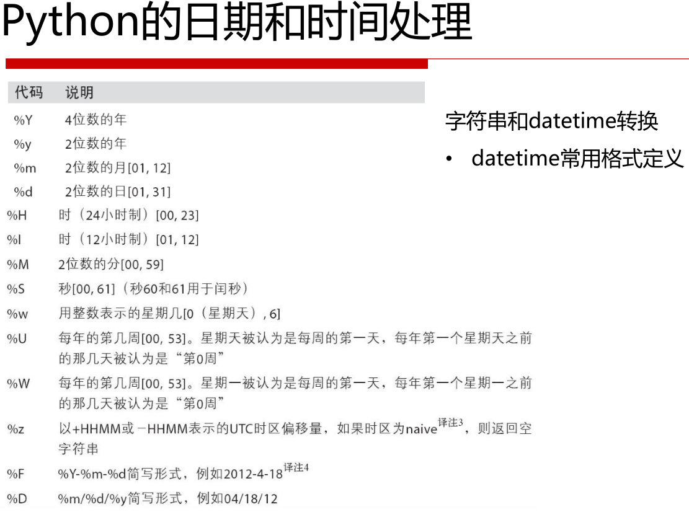
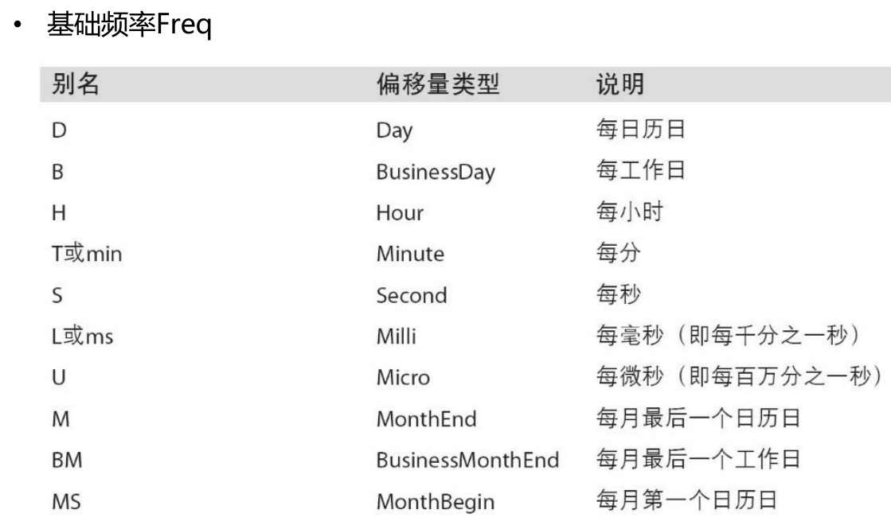
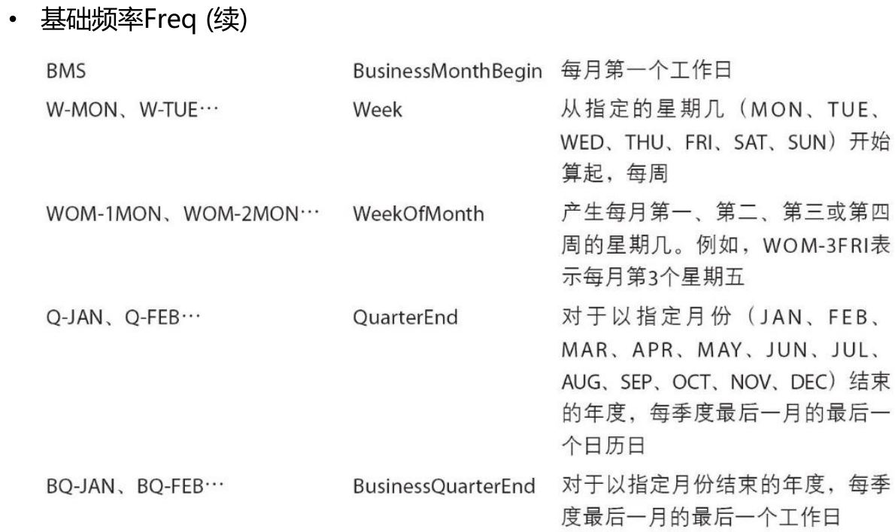
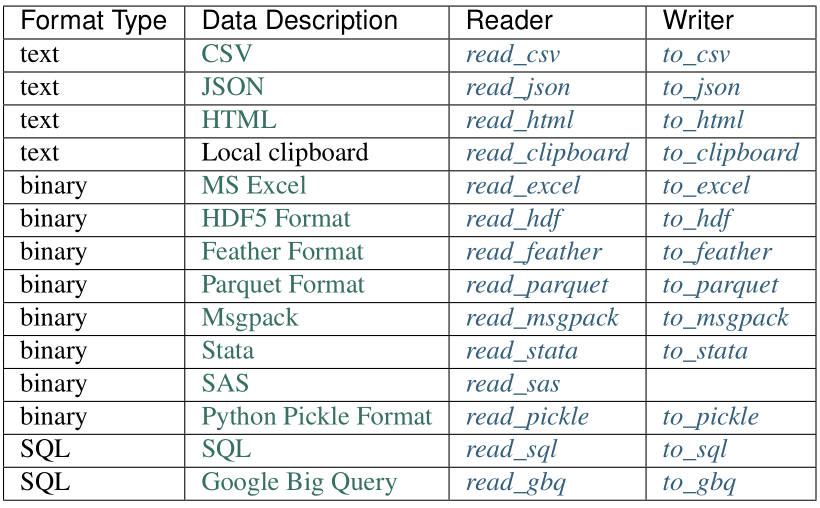

# Python-Pandas库

## 1、导入panda库

```python
import pandas as pd
```

************************

## 2、创建系列

```python
'''创建空系列'''
# 创建系列用Series()函数
s = pd.Series()  --->Series([], dtype: float64)
```

```python
'''从ndarray创建'''
data = np.array(['a','b','c','d'])      #！只能是一维数组
s = pd.Series(data)      #使用默认索引值
--->0    a
    1    b
    2    c
    3    d
    dtype: object

------------------------------------------

s = pd.Series(data,index=[100,101,102,103],name = 'A')      #指定了索引值和列名，同上区别
--->100    a
    101    b
    102    c
    103    d
    name:A,dtype: object
```

```python
'''从列表创建'''
s = pd.Series([2, 4, 6, 8, 10])      #使用默认索引值
--->
0     2
1     4
2     6
3     8
4    10
dtype: int64

------------------------------------------

# 将系列转换回列表
s.tolist()
--->[2, 4, 6, 8, 10]

------------------------------------------

# 如果列表内有非实数类型，进行强制转换
s1 = pd.Series(['100', '200', 'python', '300.12', '400'])
--->
0       100
1       200
2    python #非实数
3    300.12
4       400
dtype: object

s2 = pd.to_numeric(s1, errors='coerce')
--->
0    100.00
1    200.00
2       NaN #转换为空值
3    300.12
4    400.00
dtype: float64

------------------------------------------

# 如果列表有多重组合
s = pd.Series([
    ['Red', 'Green', 'White'],
    ['Red', 'Black'],
    ['Yellow']])
--->
0    [Red, Green, White]
1           [Red, Black]
2               [Yellow]
dtype: object

# 转换成系列
s.apply(pd.Series).stack().reset_index(drop=True)
--->
0       Red
1     Green
2     White
3       Red
4     Black
5    Yellow
dtype: object
```

```python
'''从字典创建'''
data = {'a' : 0., 'b' : 1., 'c' : 2.}
s = pd.Series(data)      #使用字典的键作为索引值
--->a    0.0
    b    1.0
    c    2.0
    dtype: float64
------------------------------------------
data = {'a' : 0., 'b' : 1., 'c' : 2.}
s = pd.Series(data,index=['b','c','d','a'])      #指定了索引值，同上区别
--->b    1.0
    c    2.0
    d    NaN      #！如果指定的索引值不包含在字典键中，则返回NaN
    a    0.0      #索引顺序=指定索引值的顺序
    dtype: float64
```

```python
'''从标量创建'''
s = pd.Series(5, index=[0, 1, 2, 3])      #重复标量值值以匹配索引的长度
--->0    5
    1    5
    2    5
    3    5
    dtype: int64
```

************************

## 3、索引系列

```python
'''根据位置索引'''
s = pd.Series([1,2,3,4,5],index = ['a','b','c','d','e'])
--->a    1
    b    2
    c    3
    d    4
    e    5
    dtype: int64

s[0]  --->1

s[:3]      #检索前三个元素
--->a    1
    b    2
    c    3
    dtype: int64

s[-3:]      #检索最后三个元素
--->c    3
    d    4
    e    5
    dtype: int64
```

```python
'''根据标签索引'''
s['a']  --->1

s[['a','c','d']]      #！必须用列表把多个标签括起来
--->a  1
    c  3
    d  4
    dtype: int64
```

```python
'''获取数据'''
s.values
--->array([1, 2, 3, 4, 5], dtype=int64)
```

```python
'''获取索引'''
s.index
--->Index(['a', 'b', 'c', 'd', 'e'], dtype='object')
```

```python
'''name属性'''
# 给系列加个名称
s.name = 'temp'

# 给系列的所有加个名称
s.index.name = 'year'
--->year
    a    1
    b    2
    c    3
    d    4
    e    5
    Name: temp, dtype: int64

# 查看是否含有重复标签
s.index.is_unique  ---> True  #无重复标签
```

```python
'''多重索引和分级'''
# 示例系列
mser = pd.Series(np.random.rand(6),
                index = [['white','white','blue','blue','red','red'],
                         ['up','down','up','down','up','down']])
--->
white  up      0.545872
       down    0.718607
blue   up      0.189105
       down    0.206879
red    up      0.515111
       down    0.975803
dtype: float64

# 索引值
mser.index
--->
MultiIndex(levels=[['blue', 'red', 'white'], ['down', 'up']],
           labels=[[2, 2, 0, 0, 1, 1], [1, 0, 1, 0, 1, 0]])

# 选取一级索引的值
mser['white']
--->
up      0.545872
down    0.718607
dtype: float64

# 选取二级索引的值
mser[:,'up']
--->
white    0.545872
blue     0.189105
red      0.515111
dtype: float64

# 选取多重索引的值
mser['white','up']  --->0.54587152855700549

#一维表转二维表
mser.unstack()
--->
           down        up
blue   0.206879  0.189105
red    0.975803  0.515111
white  0.718607  0.545872

#二维表转一维表
mser.unstack().stack()
--->
blue   down    0.206879
       up      0.189105
red    down    0.975803
       up      0.515111
white  down    0.718607
       up      0.545872
dtype: float64
```

```python
# 判断单个值是否存在
s = pd.Series(range(5))
print(s==4)
--->0    False
    1    False
    2    False
    3    False
    4     True
    dtype: bool

------------------------------------------
# 判断多个值是否存在
s = pd.Series(list('abc'))
x = s.isin(['a', 'c', 'e'])      # 返回的是系列的bool值
print(x)
--->0     True
    1    False
    2     True
    dtype: bool
```

************************

## 4、创建数据帧

```python
'''创建空数据帧'''
# 创建数据帧用DataFrame()函数
df = pd.DataFrame()
--->Empty DataFrame
    Columns: []
    Index: []
```

```python
'''从列表创建1'''
data = [1,2,3,4,5]
df = pd.DataFrame(data)      #默认列名称
--->   0
    0  1
    1  2
    2  3
    3  4
    4  5
------------------------------------------
'''从列表创建2'''
data = [['Alex',10],['Bob',12],['Clarke',13]]

#指定列名称（注意顺序），指定参数类型，
df = pd.DataFrame(data,columns=['Name','Age'],dtype=float)
--->     Name  Age
    0    Alex   10.0
    1     Bob   12.0
    2  Clarke   13.0
------------------------------------------
'''从列表创建3'''
#！字典的键作为列名称
data = [{'a': 1, 'b': 2},{'a': 5, 'b': 10, 'c': 20}]

#索引作为行名称，且长度与列表长度相同
df1 = pd.DataFrame(data, index=['first', 'second'])
--->        a   b     c
    first   1   2   NaN      #！NaN(不是数字)被附加在缺失的区域
    second  5  10  20.0
------------------------------------------
'''从列表创建4'''
data = [{'a': 1, 'b': 2},{'a': 5, 'b': 10, 'c': 20}]

#指定了列名称
df1 = pd.DataFrame(data, index=['first', 'second'], columns=['a', 'b'])
--->        a   b
    first   1   2
    second  5  10

#！同上区别
df2 = pd.DataFrame(data, index=['first', 'second'], columns=['a', 'b1'])
--->        a  b1      #由于b1没有在列表中，因此该列为NaN
    first   1 NaN
    second  5 NaN
```

```python
'''从字典来创建1'''
#！字典内的列表必须形状相同，字典的键作为列名称
#！缺点：字典内列表长度必须一致
data = {'Name':['Tom', 'Jack', 'Steve', 'Ricky'],'Age':[28,34,29,42]}

# 行名称可选，若指定必须与列长度相同
df = pd.DataFrame(data, index=['rank1','rank2','rank3','rank4'])
--->       Age   Name
    rank1   28    Tom
    rank2   34   Jack
    rank3   29  Steve
    rank4   42  Ricky
------------------------------------------
'''从字典来创建2'''
#！优点：如果字典内列表长度不一致，会有NaN填充
d = {'one' : pd.Series([1, 2, 3], index=['a', 'b', 'c']),
      'two' : pd.Series([1, 2, 3, 4], index=['a', 'b', 'c', 'd'])}
df = pd.DataFrame(d)
--->   one  two      #如果不能一一对应，则用NaN填充
    a  1.0    1
    b  2.0    2
    c  3.0    3
    d  NaN    4
```

```python
'''将系列转换为数据帧'''
s = pd.Series([1,2,3,4,5],index = ['a','b','c','d','e'])
--->
a    1
b    2
c    3
d    4
e    5
dtype: int64

df = s.to_frame()  #转换函数
--->
   0
a  1
b  2
c  3
d  4
e  5
```

```python
'''创建随机数据帧'''
df = pd.util.testing.makeMixedDataFrame()
--->
+───+──────+──────+───────+─────────────+
|   | A    | B    | C     | D           |
+───+──────+──────+───────+─────────────+
| 0 | 0.0  | 0.0  | foo1  | 2009-01-01  |
| 1 | 1.0  | 1.0  | foo2  | 2009-01-02  |
| 2 | 2.0  | 0.0  | foo3  | 2009-01-05  |
| 3 | 3.0  | 1.0  | foo4  | 2009-01-06  |
| 4 | 4.0  | 0.0  | foo5  | 2009-01-07  |
+───+──────+──────+───────+─────────────+
```

## 5、索引数据帧

**按位置索引都不包括末尾的值!
按标签索引都包括末尾的值!**

```python
'''列索引'''
d = {'one' : pd.Series([1, 2, 3], index=['a', 'b', 'c']),
      'two' : pd.Series([1, 2, 3, 4], index=['a', 'b', 'c', 'd'])}

df = pd.DataFrame(d)
--->
+───+──────+──────+
|   | one  | two  |
+───+──────+──────+
| a | 1.0  | 1    |
| b | 2.0  | 2    |
| c | 3.0  | 3    |
| d | NaN  | 4    |
+───+──────+──────+

df ['one']      #列索引只能通过列名称
--->a    1.0
    b    2.0
    c    3.0
    d    NaN
    Name: one, dtype: float64
```

```python
'''行索引-按行名称'''
df.loc['b']      #行索引使用.loc
--->one    2.0
    two    2.0
    Name: b, dtype: float64
------------------------------------------
'''行索引-按位置1'''
df.iloc[2]      #！同上区别，使用.iloc
--->one   3.0
    two   3.0
    Name: c, dtype: float64
------------------------------------------
'''行索引-按位置2'''
df[2:4]
--->      one    two
    c     3.0     3
    d     NaN     4
```

```python
'''多行多列索引1'''
df.loc[['a','c'],['one','two']]
--->   one  two
    a  1.0    1
    c  3.0    3

# 按行数和列名称取值
df.loc[df.index[[0, 2]], ['one', 'two']]
--->   one  two
   a  1.0    1
   c  3.0    3
------------------------------------------
'''多行多列索引2'''
df.iloc[1:3, 1:2]      #索引值只能是数字
--->   two
    b    2
    c    3
```

```python
'''按条件取值'''
df = df[(df['one'] == 1) | (df['one'] == 3)]      #取one列等于1 或 等于3的行
--->   one  two
    a  1.0    1
    c  3.0    3
------------------------------------------
df = df[(df['one'] == 1) & (df['two'] == 1)]      #！同上区别，取one列等于1 且 two列等于1的行
--->   one  two
    a  1.0    1
------------------------------------------
x = df.loc[df['one'].isin([1,2]),['one','two']]  #notin用~表示
--->   one  two
    a  1.0    1
    b  2.0    2
------------------------------------------
# 比较两列值的大小，取其中大/小的值
df['three'] = np.where(df['one'] >= df ['two'],'one','two')
--->
   one  two three
a  1.0    1   one
b  2.0    2   one
c  3.0    3   one
d  NaN    4   two
```

```python
'''按列类型取值'''
# 示例
df = pd.DataFrame({'id':[i for i in range(1,6)],
                   'gender':np.random.choice(['f','m'],5),
                   'age':np.random.randint(20,30,size = 5),
                   'level':pd.date_range('2019/11/03', periods=5)
                   })
--->
   id gender age level
0  1   m     28  2019-11-03
1  2   m     25  2019-11-04
2  3   m     20  2019-11-05
3  4   m     20  2019-11-06
4  5   m     27  2019-11-07
------------------------------------------
df.select_dtypes(include=['number','object'])   # 选择数值和字符类型的列
--->
 id gender age
0 1 m      28
1 2 m      25
2 3 m      20
3 4 m      20
4 5 m      27
------------------------------------------
df.select_dtypes(exclude=['datetime'])  # 排除日期类型的列
--->
 id gender age
0 1 m      28
1 2 m      25
2 3 m      20
3 4 m      20
4 5 m      27
```

```python
'''按字段类型取值'''
df.select_dtypes(include=[np.number])   # 取数值类型的字段列，其他选择如'float64'、'bool'
--->
 one two
a 1.0 1
b 2.0 2
c 3.0 3
d NaN 4
------------------------------------------
df.select_dtypes(exclude=['int64']) #排除整型字段
--->
 one
a 1.0
b 2.0
c 3.0
d NaN
```

************************

## 6、操作数据帧

```python
'''列添加'''
d = {'one' : pd.Series([1, 2, 3], index=['a', 'b', 'c']),
      'two' : pd.Series([1, 2, 3, 4], index=['a', 'b', 'c', 'd'])}

df = pd.DataFrame(d)
--->   one  two
    a  1.0    1
    b  2.0    2
    c  3.0    3
    d  NaN    4
------------------------------------------
# 添加列
df['three']=pd.Series([10,20,30],index=['a','b','c'])

# 也可以把已有的列加减乘除后作为一个新列
df['four']=df['one']+df['three']

#以上两个都结果：
--->      one   two   three    four
    a     1.0    1    10.0     11.0
    b     2.0    2    20.0     22.0
    c     3.0    3    30.0     33.0
    d     NaN    4     NaN     NaN
------------------------------------------
#确定添加列与原数据的映射关系
cat = {2:'b',3:'c',4:'d'}

#map函数对指定列进行映射
df['cat'] = df['two'].map(cat)  #没有映射到值填充NaN
--->
   one  two  cat
a  1.0    1  NaN
b  2.0    2    b
c  3.0    3    c
d  NaN    4    d
```

```python
'''列删除'''
d = {'one' : pd.Series([1, 2, 3], index=['a', 'b', 'c']),
     'two' : pd.Series([1, 2, 3, 4], index=['a', 'b', 'c', 'd']),
     'three' : pd.Series([10,20,30], index=['a','b','c'])}

df = pd.DataFrame(d)
--->      one   three  two
    a     1.0    10.0   1
    b     2.0    20.0   2
    c     3.0    30.0   3
    d     NaN     NaN   4
------------------------------------------
# 删除操作与列表的删除一样，也是使用del或pop()函数
del df['one']   # 无返回值

df.pop('two')   # 返回删除的列
--->
a    1
b    2
c    3
d    4
Name: two, dtype: int64

df.drop('one',axis=1)   # 返回删除后的数据帧
--->
 two three
a 1 10.0
b 2 20.0
c 3 30.0
d 4 NaN
```

```python
'''行添加'''
df = pd.DataFrame([[1, 2], [3, 4]], columns = ['a','b'])
df2 = pd.DataFrame([[5, 6], [7, 8]], columns = ['a','b'])

# 用append()把一个数据帧添加到另一个数据帧后面
df = df.append(df2)
--->   a  b
    0  1  2
    1  3  4
    0  5  6
    1  7  8
```

```python
'''删除行'''
# 接上例
df = df.drop(0)      #一共有两行被删除，因为这两行包含相同的标签0
--->  a b
    1 3 4
    1 7 8
```

```python
'''基本功能'''
# 示例
data = {'Name':['Tom','James','Ricky','Vin','Steve','Minsu','Jack'],
        'Age':[25,26,25,23,30,29,23],
        'Rating':[4.23,3.24,3.98,2.56,3.20,4.6,3.8]
        }

df = pd.DataFrame(data)
--->   Age   Name  Rating
    0   25    Tom    4.23
    1   26  James    3.24
    2   25  Ricky    3.98
    3   23    Vin    2.56
    4   30  Steve    3.20
    5   29  Minsu    4.60
    6   23   Jack    3.80
------------------------------------------
'''返回数组的基本属性'''
# 返回行或列标签
df.index  --->RangeIndex(start=0, stop=7, step=1)
df.columns  --->Index(['Age', 'Name', 'Rating'], dtype='object')

# 删除某个行或列标签
df.index.delete(2)  --->Int64Index([0, 1, 3, 4, 5, 6], dtype='int64')
df.columns.delete(2)  --->Index(['Name', 'Age'], dtype='object')

# 插入行或列标签
df.index.insert(2,'insert_index')
--->Index([0, 1, 'insert_index', 2, 3, 4, 5, 6], dtype='object')

df.columns.insert(2,'insert_column')
--->Index(['Name', 'Age', 'insert_column', 'Rating'], dtype='object')

# 返回行列标签
df.axes
--->[RangeIndex(start=0, stop=7, step=1), Index(['Age', 'Name', 'Rating'], dtype='object')]

# 查看行标签是否重复
df.index.is_unique  --->True  #无重复

# 返回对象的维数
df.ndim  --->2

# 返回维度
df.shape  --->(7, 3)

# 返回元素数
df.size  --->21

# 检查是否有空值
df.empty  --->False

# 返回每列的数据类型
df.dtypes
--->Age         int64
    Name       object
    Rating    float64
    dtype: object

# 改变指定列的数据类型
df['Age'] = df['Age'].astype('float64')
--->Age       float64      # Age列的数值改为浮点型
    Name       object
    Rating    float64
    dtype: object
------------------------------------------
'''返回与组内值有关的信息'''
# 返回值
df.values  
--->[[25 'Tom' 4.23]
    [26 'James' 3.24]
    [25 'Ricky' 3.98]
    [23 'Vin' 2.56]
    [30 'Steve' 3.2]
    [29 'Minsu' 4.6]
    [23 'Jack' 3.8]]

# 返回指定列的唯一值
df['Name'].unique()
--->['Tom' 'James' 'Ricky' 'Vin' 'Steve' 'Minsu' 'Jack']

# 返回每列中的 值 个数
df.count()
--->Age       7
    Name      7
    Rating    7
    dtype: int64

# 返回每列中的 值 非重复 个数
df.nunique()
--->Age       5
    Name      7
    Rating    7
    dtype: int64

# 返回指定列的 各个值 的个数
#！同上区别
df['Age'].value_counts()
--->23    2
    25    2
    30    1
    29    1
    26    1
    Name: Age, dtype: int64

# 返回指定列的 各个值 的 比例/频率
df['Age'].value_counts(normalize=True)
--->
23    0.285714
25    0.285714
30    0.142857
29    0.142857
26    0.142857
Name: Age, dtype: float64

# 返回前n行
df.head(2)
--->   Age   Name  Rating
    0   25    Tom    4.23
    1   26  James    3.24

# 返回最后n行
df.tail(2)
--->   Age   Name  Rating
    5   29  Minsu     4.6
    6   23   Jack     3.8
------------------------------------------
#行列转置
df.T  
--->           0      1      2     3      4      5     6
    Age       25     26     25    23     30     29    23
    Name     Tom  James  Ricky   Vin  Steve  Minsu  Jack
    Rating  4.23   3.24   3.98  2.56    3.2    4.6   3.8
```

```python
'''重建索引'''
# 示例数组
df = pd.DataFrame(np.arange(15).reshape(5,3),columns=['col1','col2','col3'])
--->   col1  col2  col3
    0     0     1     2
    1     3     4     5
    2     6     7     8
    3     9    10    11
    4    12    13    14

# 重建索引，如果指定行、列没有值，则填充NaN
df_reindexed = df.reindex(index=[0,2,5], columns=['col1', 'col2', 'col4'])
--->   col1  col2  col4
    0   0.0   1.0   NaN
    2   6.0   7.0   NaN
    5   NaN   NaN   NaN
------------------------------------------
# 把某一列设为索引
df = df.set_index('col1')      #把’col1‘设置为索引
--->      col2  col3
    col1
    0        1     2
    3        4     5
    6        7     8
    9       10    11
    12      13    14

# 将上面的结果还原
df = df.reset_index()
--->   col1  col2  col3
    0     0     1     2
    1     3     4     5
    2     6     7     8
    3     9    10    11
    4    12    13    14
```

```python
'''修改行名称或列名称'''
df.rename(columns={'col1' : 'c1', 'col2' : 'c2'},index = {0 : 'apple', 1 : 'banana', 2 : 'durian'})
--->        c1  c2  col3
    apple    0   1     2
    banana   3   4     5
    durian   6   7     8
    3        9  10    11
    4       12  13    14
```

```python
'''数据帧迭代'''
for col in df:
   print (col)
--->col1      # 默认迭代列名称
    col2
    col3
------------------------------------------
# 对列数据迭代
for col,col_value in df.iteritems():
   print (col,':',col_value)
--->col1 : 0     0
    1     3
    2     6
    3     9
    4    12
    Name: col1, dtype: int32
以下结果略......
------------------------------------------
# 对行数据迭代1
for row,row_value in df.iterrows():
   print (row,':',row_value)
--->0 : col1    0
    col2    1
    col3    2
    Name: 0, dtype: int32
以下结果略......
------------------------------------------
# 对行数据迭代2
for row in df.itertuples():
   print (row)
--->Pandas(Index=0, col1=0, col2=1, col3=2)
    Pandas(Index=1, col1=3, col2=4, col3=5)
以下结果略......
```

```python
'''排序'''
# 示例
df = pd.DataFrame(np.arange(15).reshape(5,3),index = [0,2,4,1,3],columns=['col2','col1','col3'])
--->   col2  col1  col3
    0     0     1     2
    2     3     4     5
    4     6     7     8
    1     9    10    11
    3    12    13    14
------------------------------------------
# 对行名称进行排序
sorted_df=df.sort_index()      #！行名称可以是字母或数字，但不能是组合
--->      col2  col1  col3      #倒序添加“ascending=False”参数
    0     0     1     2
    1     9    10    11
    2     3     4     5
    3    12    13    14
    4     6     7     8
------------------------------------------
# 对列名称进行排序
sorted_df=df.sort_index(axis = 1)      #！列名称可以是字母或数字，但不能是组合
--->   col1  col2  col3
    0     1     0     2
    2     4     3     5
    4     7     6     8
    1    10     9    11
    3    13    12    14
------------------------------------------
# 对列值进行排序
sorted_df=df.sort_values(by=['col1','col2'],ascending=[False,True])
--->   col2  col1  col3
    3    12    13    14
    1     9    10    11
    4     6     7     8
    2     3     4     5
    0     0     1     2
------------------------------------------
# 对列值排序并标记
df = pd.DataFrame({'a':[4,2,1,2,3],
                   'b':[5,3,3,1,4]})

df['rank_dense'] = df['b'].rank(method='dense')  #相同值，不堆叠序号
df['rank_first'] = df['b'].rank(method='first')  #相同值，先出现先排序
df['rank_min'] = df['b'].rank(method='min')  #相同值，以最小序号堆叠
df['rank_max'] = df['b'].rank(method='max')  #相同值，以最大序号堆叠
--->
   a  b  rank_dense  rank_first  rank_min  rank_max
0  4  5         4.0         5.0       5.0       5.0
1  2  3         2.0         2.0       2.0       3.0
2  1  3         2.0         3.0       2.0       3.0
3  2  1         1.0         1.0       1.0       1.0
4  3  4         3.0         4.0       4.0       4.0
------------------------------------------
# 对列值进行组内排序并标记
df['group_rank'] = df.groupby('a')['b'].rank(method='dense')
--->
   a  b  group_rank
0  4  5         1.0
1  2  3         2.0
2  1  3         1.0
3  2  1         1.0
4  3  4         1.0
```

```python
'''重复值操作'''
#原始数组
df = pd.DataFrame({'data1' : ['a'] * 4 + ['b'] * 4,
                   'data2' : np.random.randint(0, 4, 8)})

--->  data1  data2
    0     a      3
    1     a      2
    2     a      1
    3     a      1
    4     b      0
    5     b      0
    6     b      0
    7     b      2
------------------------------------------
# 查找重复值
df.duplicated()      # 未附加条件列，默认行所有值都一样才是重复的
--->0    False
    1    False
    2    False
    3     True
    4    False
    5     True
    6     True
    7    False
    dtype: bool
------------------------------------------
# 去除重复值，保留重复的第一行数据，跟排序有关
df.drop_duplicates()      # 根据上面结果去掉重复的行
df[~df.duplicated()]      # 结果相同
--->  data1  data2
    0     a      3
    1     a      2
    2     a      1
    4     b      0
    7     b      2
------------------------------------------
# 仅针对data2列去除重复值
df.drop_duplicates('data2')  # subset=[]可对多列同时相同的行去重
--->  data1  data2
    0     a      3
    1     a      2
    2     a      1
    4     b      0
```

```python
'''哑变量处理'''
df = pd.DataFrame({'id':[i for i in range(1,6)],
                   'gender':np.random.choice(['f','m'],5),
                   'age':np.random.randint(20,30,size = 5),
                   'level':np.random.choice(['v1','v2','v3','v4'],5)
                   })
--->
+───+─────+─────────+──────+─────────────+
|   | id  | gender  | age  | level       |
+───+─────+─────────+──────+─────────────+
| 0 | 1   | f       | 21   | 2019-11-03  |
| 1 | 2   | f       | 28   | 2019-11-04  |
| 2 | 3   | f       | 27   | 2019-11-05  |
| 3 | 4   | f       | 22   | 2019-11-06  |
| 4 | 5   | m       | 27   | 2019-11-07  |
+───+─────+─────────+──────+─────────────+

pd.get_dummies(df,columns = ['gender','level'])
--->
+────+─────+──────+───────────+───────────+───────────────────+───────────────────+───────────────────+───────────────────+───────────────────+
|    | id  | age  | gender_f  | gender_m  | level_2019-11-03  | level_2019-11-04  | level_2019-11-05  | level_2019-11-06  | level_2019-11-07  |
+────+─────+──────+───────────+───────────+───────────────────+───────────────────+───────────────────+───────────────────+───────────────────+
| 0  | 1   | 21   | 1         | 0         | 1                 | 0                 | 0                 | 0                 | 0                 |
| 1  | 2   | 28   | 1         | 0         | 0                 | 1                 | 0                 | 0                 | 0                 |
| 2  | 3   | 27   | 1         | 0         | 0                 | 0                 | 1                 | 0                 | 0                 |
| 3  | 4   | 22   | 1         | 0         | 0                 | 0                 | 0                 | 1                 | 0                 |
| 4  | 5   | 27   | 0         | 1         | 0                 | 0                 | 0                 | 0                 | 1                 |
+────+─────+──────+───────────+───────────+───────────────────+───────────────────+───────────────────+───────────────────+───────────────────+
```

```python
'''分裂数据帧'''
df_1 = df.sample(frac=0.6,random_state=42)
--->
+───+─────+─────────+──────+─────────────+
|   | id  | gender  | age  | level       |
+───+─────+─────────+──────+─────────────+
| 1 | 2   | f       | 28   | 2019-11-04  |
| 4 | 5   | m       | 27   | 2019-11-07  |
| 2 | 3   | f       | 27   | 2019-11-05  |
+───+─────+─────────+──────+─────────────+

df_2 = df.drop(df_1.index)
--->
+───+─────+─────────+──────+─────────────+
|   | id  | gender  | age  | level       |
+───+─────+─────────+──────+─────────────+
| 0 | 1   | f       | 21   | 2019-11-03  |
| 3 | 4   | f       | 22   | 2019-11-06  |
+───+─────+─────────+──────+─────────────+
```

```python
'''分组'''
# 示例
age = np.random.randint(12,80,size = 1000)
s = pd.Series(age)
--->
0    66
1    74
2    77
3    34
4    44
5    17
6    37
7    23
8    17
9    51
dtype: int32
------------------------------------------
# 对年龄进行分组，指定分组年龄
age_cut = pd.cut(s,bins = [0,18,45,60,80],right = False,labels = ['未成年','青年','中年','老年'])
--->
0     老年
1     老年
2     老年
3     青年
4     青年
5    未成年
6     青年
7     青年
8    未成年
9     中年
dtype: category
Categories (4, object): [未成年 < 青年 < 中年 < 老年]
------------------------------------------
# 指定分组数量，不指定年龄
age_cut = pd.cut(s,4,labels = ['未成年','青年','中年','老年'])
--->
0     老年
1     老年
2     老年
3     青年
4     青年
5    未成年
6     青年
7    未成年
8    未成年
9     中年
dtype: category
Categories (4, object): [未成年 < 青年 < 中年 < 老年]
------------------------------------------
# qcut()使每组的个数相同，但组距不同
age_cut = pd.qcut(s,4)
--->
0      (62.25, 77.0]
1      (62.25, 77.0]
2      (62.25, 77.0]
3      (25.75, 40.5]
4      (40.5, 62.25]
5    (16.999, 25.75]
6      (25.75, 40.5]
7    (16.999, 25.75]
8    (16.999, 25.75]
9      (40.5, 62.25]
dtype: category
Categories (4, interval[float64]): [(16.999, 25.75] < (25.75, 40.5] < (40.5, 62.25] < (62.25, 77.0]]

pd.value_counts(age_qcut)
--->
(62.25, 77.0]      3
(16.999, 25.75]    3
(40.5, 62.25]      2
(25.75, 40.5]      2
dtype: int64
```

```python
'''多重索引的操作'''
# 示例数组
mframe = pd.DataFrame(np.random.randn(16).reshape(4,4),
                      index = [['white','white','red','red'],['up','down','up','down']],
                      columns = [['pen','pen','paper','paper'],[1,2,1,2]])
--->
                 pen               paper
                   1         2         1         2
white up    0.489070 -0.230402  0.904601 -0.857087
      down -1.471774 -0.528257  1.174473 -0.458336
red   up   -1.022719 -0.579360 -2.918812  0.826557
      down -0.881737  0.208675  1.190373 -1.422893
------------------------------------------
# 为 行、列索引 添加名称
mframe.index.names = ['colors','status']
mframe.columns.names = ['obj','id']
--->
obj                 pen               paper
id                    1         2         1         2
colors status
white  up      0.489070 -0.230402  0.904601 -0.857087
       down   -1.471774 -0.528257  1.174473 -0.458336
red    up     -1.022719 -0.579360 -2.918812  0.826557
       down   -0.881737  0.208675  1.190373 -1.422893
------------------------------------------
# 交换 行索引 的位置
mframe.swaplevel('colors','status')
--->
obj                 pen               paper
id                    1         2         1         2
status colors
up     white   0.489070 -0.230402  0.904601 -0.857087
down   white  -1.471774 -0.528257  1.174473 -0.458336
up     red    -1.022719 -0.579360 -2.918812  0.826557
down   red    -0.881737  0.208675  1.190373 -1.422893
------------------------------------------
# 按 行索引 统计数据
mframe.sum(level = 'colors')
--->
obj          pen               paper
id             1         2         1         2
colors
red    -1.904457 -0.370685 -1.728439 -0.596336
white  -0.982704 -0.758658  2.079074 -1.315423
------------------------------------------
# 按 列索引 统计数据
mframe.sum(level = 'id',axis = 1)    # 参数axis = 1
--->
id                    1         2
colors status
white  up      1.393671 -1.087489
       down   -0.297301 -0.986592
red    up     -3.941531  0.247198
       down    0.308635 -1.214218
```

```python
'''减少数据帧的内存使用'''
# https://youtu.be/wDYDYGyN_cw

# 示例数据帧
df.head()
--->
    beer_servings  continent
0     0     Asia
1     89     Europe
2     25     Africa
3     245     Europe
4     217     Africa
------------------------------------------
# 查看数据帧内存信息
df.memory_usage(deep=True)
--->
Index               80
beer_servings     1544
continent        12332      # 注意这个数字
dtype: int64
------------------------------------------
# ！如果字符串列有大量重复内容，将其type转化为'category'，可以明显改善内存使用
df['continent'] = df.continent.astype('category')
------------------------------------------
# 再次查看数据帧内存信息
df.memory_usage(deep=True)
--->
Index              80
beer_servings    1544
continent         744      # 内存占用缩小了94%！
dtype: int64
------------------------------------------
# 查看转化后的列
df.continent.head()
--->
0      Asia
1    Europe
2    Africa
3    Europe
4    Africa
Name: continent, dtype: category
Categories (6, object): [Africa, Asia, Europe, North America, Oceania, South America]
------------------------------------------
# 字符串列转化为'category'，实际是提取所有出现的值，以int类型代替
df.continent.cat.categories
--->
Index(['Africa', 'Asia', 'Europe', 'North America', 'Oceania',
       'South America'],
      dtype='object')

df.continent.cat.codes.head()
--->
0    1
1    2
2    0
3    2
4    0
dtype: int8
------------------------------------------
# 可以对转化的类进行排序
df.continent.cat.set_categories(['Africa', 'Asia', 'Europe', 'North America', 'Oceania','South America'],inplace=True)
```

************************

## 7、pandas的函数运算

```python
data = {'Name':['Tom','James','Ricky'],
        'Age':[25,26,25],
        'Rating':[4.23,3.24,3.98]
        }

df = pd.DataFrame(data)

# 示例数据帧
    Age    Name  Rating
0    25     Tom    4.23
1    26   James    3.24
2    25   Ricky    3.98
```

```python
'''描述性统计'''
（1）求和
# 默认对列求和
df.sum()
--->Age                  76
    Name      TomJamesRicky
    Rating            11.45
    dtype: object
------------------------------------------
# 对行求和
df.sum(1)
--->0     29.23
    1     29.24
    2     28.98
    dtype: float64
------------------------------------------
# 求累加
df['cumsum'] = df['Rating'].cumsum()
--->   Age   Name  Rating  cumsum
    0   25    Tom    4.23    4.23
    1   26  James    3.24    7.47
    2   25  Ricky    3.98   11.45
```

```python
'''描述性统计'''
（2）求平均值
#默认对每一个数值列求平均值
df.mean()
--->Age       25.857143
    Rating     3.658571
    dtype: float64

# 求全组数值的平均值
# 同上区别
df.mean().mean()  --->14.757857142857143

#扩展：求平均值mean()、求方差var()、求标准差std()
```

```python
（3）统计汇总
# 仅对数值类型的列作统计汇总
df.describe()
--->             Age     Rating
    count   3.000000  3.000000
    mean   25.333333  3.816667
    std     0.577350  0.514814
    min    25.000000  3.240000
    25%    25.000000  3.610000
    50%    25.000000  3.980000
    75%    25.500000  4.105000
    max    26.000000  4.230000
------------------------------------------
# 对字符串列汇总
df.describe(include=['object'])      #！需要添加参数include
--->         Name
    count       3
    unique      3
    top     Ricky
    freq        1
------------------------------------------
# 对同时对数值列和字符串列汇总
df. describe(include='all')      #！同上区别
--->              Age   Name     Rating
    count    3.000000      3  3.000000
    unique        NaN      3       NaN
    top           NaN  Ricky       NaN
    freq          NaN      1       NaN
    mean    25.333333    NaN  3.816667
    std      0.577350    NaN  0.514814
    min     25.000000    NaN  3.240000
    25%     25.000000    NaN  3.610000
    50%     25.000000    NaN  3.980000
    75%     25.500000    NaN  4.105000
    max     26.000000    NaN  4.230000
```

```python
（3）相关性统计
# 环比函数：此函数将每个元素与其前一个元素进行比较，并计算变化百分比
df['Age'].pct_change()      # 想应用到行上，那么可使用axis = 1参数
--->0         NaN      #！不能对字符串操作
    1    0.040000
    2   -0.038462
    Name: Age, dtype: float64
------------------------------------------
# 比较指定两列的相关性
df['Age'].corr(df['Rating'])
--->-0.970074817503
------------------------------------------
# 比较所有列的相关性，自动排出字符串列
df.corr()
--->             Age    Rating
    Age     1.000000 -0.970075
    Rating -0.970075  1.000000
------------------------------------------
# 比较两列数据相同的个数
pd.crosstab(df.Age,df.Rating)
--->
Rating 3.24 3.98 4.23
Age
25 0 1 1
26 1 0 0    #解读：年龄26得分3.24的只有1人，年龄25得分3.98的也只有1人
```

```python
（4）各列最大最小值的索引
   Age   Name  Rating
0   25    Tom    4.23
1   26  James    3.24
2   25  Ricky    3.98

#求年龄和评分最高的行
max_index = df[['Age','Rating']].idxmax()
--->Age       1      #返回行索引
    Rating    0
    dtype: int64

#求年龄和评分最低的行
min_index = df[['Age','Rating']].idxmin()
--->Age       0
    Rating    1
    dtype: int64
```

```python
'''窗口函数'''
df = pd.DataFrame(np.arange(15).reshape(5,3),
                  index = ['a','b','c','d','e'],
                  columns = ['col1','col2','col3'])
--->   col1  col2  col3
    a     0     1     2
    b     3     4     5
    c     6     7     8
    d     9    10    11
    e    12    13    14
------------------------------------------
# 退后指定行数计算前面所有行的平均值
df.expanding(min_periods=3).mean()
--->   col1  col2  col3
    a   NaN   NaN   NaN
    b   NaN   NaN   NaN
    c   3.0   4.0   5.0
    d   4.5   5.5   6.5
    e   6.0   7.0   8.0
------------------------------------------
#！同上对比，计算第n、n-1、n-2行的平均值
df.rolling(window=3,min_periods=2).mean()      #window=3表示计算前3-0、3-2、3-1行
--->   col1  col2  col3      #min_periods=2表示若不足3行时最小计算行数
    a   NaN   NaN   NaN
    b   1.5   2.5   3.5
    c   3.0   4.0   5.0
    d   6.0   7.0   8.0
    e   9.0  10.0  11.0
------------------------------------------
# 设定滚动行数和最小行数
r = df.rolling(window=3,min_periods=1)

# 对单行或多行应用多个函数
r[['col1','col2']].aggregate([np.sum,np.mean])
--->   col1       col2
        sum mean   sum  mean
    a   0.0  0.0   1.0   1.0
    b   3.0  1.5   5.0   2.5
    c   9.0  3.0  12.0   4.0
    d  18.0  6.0  21.0   7.0
    e  27.0  9.0  30.0  10.0

# 将不同的函数应用于不同列
r.aggregate({'col1' : np.sum,'col2' : np.mean})
--->   col1  col2
    a   0.0   1.0
    b   3.0   2.5
    c   9.0   4.0
    d  18.0   7.0
    e  27.0  10.0
```

************************

## 8、Pandas的函数调用

```python
'''pipe函数调用'''
df = pd.DataFrame(np.arange(15).reshape(5,3),columns=['col1','col2','col3'])
--->   col1  col2  col3
    0     0     1     2
    1     3     4     5
    2     6     7     8
    3     9    10    11
    4    12    13    14
------------------------------------------
#定义一个函数：将数据帧的每个元素放大2倍
def adder(ele1,ele2):
    return ele1*ele2

# 调用函数
df.pipe(adder,2)
--->   col1  col2  col3
    0     0     2     4
    1     6     8    10
    2    12    14    16
    3    18    20    22
    4    24    26    28
```

```python
'''apply/applymap函数调用'''

# 传入的函数默认对列操作，如下求每列的最大值
df.apply(lambda x : x.max())
--->col1    12
    col2    13
    col3    14
    dtype: int64

# 如对行操作，附加axis = 1
df.apply(lambda x : x.max(),axis = 1)
--->0     2
    1     5
    2     8
    3    11
    4    14
    dtype: int64

# 求行列最大最小值的另一种方法
def f(x):
    return pd.Series([x.max(),x.min()],index = ['max','min'])

df.apply(f)      #求每列最大最小值
--->
     col1  col2  col3
max    12    13    14
min     0     1     2

df.apply(f,axis = 1)      #求每行最大最小值
--->
   max  min
0    2    0
1    5    3
2    8    6
3   11    9
4   14   12
------------------------------------------
# 比较两列的大小
def f(a, b):
    if a >= b:
        return b
    else:
        return a

df.apply(lambda x:f(x['col1'],x['col2']),axis=1)
--->
0     0
1     3
2     6
3     9
4    12
dtype: int64
------------------------------------------
# applymap对数组的所有值操作，如下每个值都扩大10倍
df.applymap(lambda x : x*10)
--->   col1  col2  col3
    0     0    10    20
    1    30    40    50
    2    60    70    80
    3    90   100   110
    4   120   130   140
```

************************

## 9、pandas的字符操作

```python
# 示例
s = pd.Series(['Tom ', ' William Rick', 'John', 'Alber@t', 'Alber@t'])
--->0             Tom
    1     William Rick
    2             John
    3          Alber@t
    4          Alber@t
dtype: object
------------------------------------------
# 用指定字符连接字符
s.str.cat(sep=' <=> ')
--->Tom  <=>  William Rick <=> John <=> Alber@t <=> Alber@t

# 将拥有不同值的变量转换为0/1数值
s.str.get_dummies()
--->    William Rick  Alber@t  John  Tom
    0              0        0     0     1
    1              1        0     0     0
    2              0        0     1     0
    3              0        1     0     0
    4              0        1     0     0

# 检查是否包含指定字符
s.str.contains(' ')
--->0     True
    1     True
    2    False
    3    False
    4    False
dtype: bool

# 字符替换
s.str.replace('@','$')
--->0             Tom
    1     William Rick
    2             John
    3          Alber$t
    4          Alber$t
dtype: object

# 重复指定字符
s.str.repeat(2)
--->0                      Tom Tom
    1     William Rick William Rick
    2                      JohnJohn
    3                Alber@tAlber@t
    4                Alber@tAlber@t
dtype: object

# 返回模式中每个元素的出现总数
s.str.count('m')
--->0    1
    1    1
    2    0
    3    0
    4    0
dtype: int64

# 返回模式的所有出现的列表
s.str.findall('i')
--->0           []
    1    [i, i, i]
    2           []
    3           []
    4           []
    dtype: object

# 字符内的大小写对换
s.str.swapcase()
--->0             tOM
    1     wILLIAM rICK
    2             jOHN
    3          aLBER@T
    4          aLBER@T
    dtype: object

# 所有字母转成小写，.upper()作用相反
--->s.str.lower()
    0             tom
    1     william rick
    2             john
    3          alber@t
    4          alber@t
    dtype: object
```

```python
'''利用字符函数清理数据的小案例'''
#原始数组
df = pd.DataFrame({'From_To': ['LoNDon_paris', 'MAdrid_miLAN', 'londON_StockhOlm',
                               'Budapest_PaRis', 'Brussels_londOn'],
              'FlightNumber': [10045, np.nan, 10065, np.nan, 10085],
              'RecentDelays': [[23, 47], [], [24, 43, 87], [13], [67, 32]],
                   'Airline': ['KLM(!)', '<Air France> (12)', '(British Airways. )',
                               '12. Air France', '"Swiss Air"']})
df
--->               Airline  FlightNumber           From_To  RecentDelays
    0               KLM(!)       10045.0      LoNDon_paris      [23, 47]
    1    <Air France> (12)           NaN      MAdrid_miLAN            []
    2  (British Airways. )       10065.0  londON_StockhOlm  [24, 43, 87]
    3       12. Air France           NaN    Budapest_PaRis          [13]
    4          "Swiss Air"       10085.0   Brussels_londOn      [67, 32]
------------------------------------------
# 1、数据列拆分
temp = df['From_To'].str.split('_', expand=True)      # expand=True表示拆分的两部分分成两列,False则为一个列表的两部分

# 2、对新生成的两列重命名
temp.columns = ['From', 'To']
--->       From         To
    0    LoNDon      paris
    1    MAdrid      miLAN
    2    londON  StockhOlm
    3  Budapest      PaRis
    4  Brussels     londOn

# 3、删除坏数据加入整理好的数据
df = df.drop('From_To', axis=1)      # 删除拆分的原始列
df = df.join(temp)      # 把拆分开店两列加回到原数组
--->               Airline  FlightNumber  RecentDelays      From         To
    0               KLM(!)       10045.0      [23, 47]    LoNDon      paris
    1    <Air France> (12)           NaN            []    MAdrid      miLAN
    2  (British Airways. )       10065.0  [24, 43, 87]    londON  StockhOlm
    3       12. Air France           NaN          [13]  Budapest      PaRis
    4          "Swiss Air"       10085.0      [67, 32]  Brussels     londOn

# 4、去除多余字符
# 用正则式保留<Airline>列的字母
df['Airline'] = df['Airline'].str.extract('([a-zA-Z\s]+)', expand=False).str.strip()
--->           Airline  FlightNumber  RecentDelays      From         To
    0              KLM       10045.0      [23, 47]    LoNDon      paris
    1       Air France           NaN            []    MAdrid      miLAN
    2  British Airways       10065.0  [24, 43, 87]    londON  StockhOlm
    3       Air France           NaN          [13]  Budapest      PaRis
    4        Swiss Air       10085.0      [67, 32]  Brussels     londOn

# 5、格式规范
"""
在 RecentDelays 中记录的方式为列表类型，由于其长度不一，这会为后期数据分析造成很大麻烦。
这里将 RecentDelays 的列表拆开，取出列表中的相同位置元素作为一列，
若为空值即用 NaN 代替
"""
    # 5.1、将带有列表的数组拆分成单独列
delays = df['RecentDelays'].apply(pd.Series)
--->delays:
          0     1     2
    0  23.0  47.0   NaN
    1   NaN   NaN   NaN
    2  24.0  43.0  87.0
    3  13.0   NaN   NaN
    4  67.0  32.0   NaN

    # 5.2、重命名拆分出来的列
delays.columns = ['delay_{}'.format(n) for n in range(1, len(delays.columns)+1)]
--->delays:
       delay_1  delay_2  delay_3
    0     23.0     47.0      NaN
    1      NaN      NaN      NaN
    2     24.0     43.0     87.0
    3     13.0      NaN      NaN
    4     67.0     32.0      NaN

    # 5.3、将原始列删除，并添加新列
df = df.drop('RecentDelays', axis=1).join(delays)
--->           Airline  FlightNumber      From         To  delay_1  delay_2  delay_3
    0              KLM       10045.0    LoNDon      paris     23.0     47.0     NaN
    1       Air France           NaN    MAdrid      miLAN      NaN      NaN     NaN
    2  British Airways       10065.0    londON  StockhOlm     24.0     43.0     87.0
    3       Air France           NaN  Budapest      PaRis     13.0      NaN     NaN
    4        Swiss Air       10085.0  Brussels     londOn     67.0     32.0     NaN
```

************************

## 10、pandas的缺失值操作

```python
df = pd.DataFrame(np.arange(6).reshape(2,3),
                  index = ['a','b'],
                  columns = ['col1','col2','col3'])

# 重新索引行名称，产生缺失值
df = df.reindex(['a','new','b'])
--->     col1  col2  col3
    a     0.0   1.0   2.0
    new   NaN   NaN   NaN
    b     3.0   4.0   5.0
------------------------------------------
# 检查是否有缺失值
df.isnull()      #.notnull()结果相反
--->      col1   col2   col3
    a    False  False  False
    new   True   True   True
    b    False  False  False

# 计算每一列有多少个缺失值
df.isnull().sum()      #.notnull()结果相反
--->col1    1
    col2    1
    col3    1
    dtype: int64

# 查看每一列是否具有缺失值
df.isnull().any(axis=0)
--->
col1    True
col2    True
col3    True
dtype: bool

# 查看每一行是否具有缺失值
df.isnull().any(axis=1)
--->
a      False
new     True
b      False
dtype: bool

# 获得全部为NA的列
df.isnull().all()
--->
col1    False
col2    False
col3    False
dtype: bool
```

```python
# 填充缺失值，用0填充
df.fillna(0))
--->     col1  col2  col3
    a     0.0   1.0   2.0
    new   0.0   0.0   0.0
    b     3.0   4.0   5.0

# 向前填充
df.fillna(method='pad')
--->     col1  col2  col3
    a     0.0   1.0   2.0
    new   0.0   1.0   2.0
    b     3.0   4.0   5.0

# 向后填充
df.fillna(method='backfill')
--->     col1  col2  col3
    a     0.0   1.0   2.0
    new   3.0   4.0   5.0
    b     3.0   4.0   5.0

# 指定列填充
df.fillna({'col1':1,'col2':2,'col3':3})
--->
     col1  col2  col3
a     0.0   1.0   2.0
new   1.0   2.0   3.0
b     3.0   4.0   5.0
```

```python
# 丢弃缺失值
df.dropna()
--->   col1  col2  col3
    a   0.0   1.0   2.0
    b   3.0   4.0   5.0

# 丢弃部分缺失值
df.dropna(how = 'all')  # 只有所有列都是na的行才会drop
--->
   col1  col2  col3
a   0.0   NaN   2.0
b   3.0   4.0   5.0
```

```python
'''替换其他数值'''
# 示例
df = pd.DataFrame(data={'Province' : ['ON','QC','BC','AL','AL','$','ON'],
                        'City' : ['?','Montreal','Vancouver','Calgary','Edmonton','Winnipeg','Windsor'],
                        'Sales' : [13,6,16,8,np.NaN,3,1]})

--->        City Province  Sales
    0          ?       ON   13.0
    1   Montreal       QC    6.0
    2  Vancouver       BC   16.0
    3    Calgary       AL    8.0
    4   Edmonton       AL    NaN
    5   Winnipeg        $    3.0
    6    Windsor       ON    1.0
------------------------------------------
# 单值替换
df = df.replace('$',np.nan)
--->5   Winnipeg      NaN    3.0      #其余行略

# 多值替换，用字典
df = df.replace({'$':np.nan,'?':np.nan})
--->0        NaN       ON   13.0
    5   Winnipeg      NaN    3.0

# 指定列替换指定值，用字典
df2 = df.replace({'City':'?'},np.nan)
--->        City Province  Sales
    0        NaN       ON   13.0
    1   Montreal       QC    6.0
    2  Vancouver       BC   16.0
    3    Calgary       AL    8.0
    4   Edmonton       AL    NaN
    5   Winnipeg        $    3.0
    6    Windsor       ON    1.0
```

************************

## 11、pandas的分组操作

```python
# 示例
df = pd.DataFrame({'Team': ['Riders', 'Riders', 'Devils',],
         'Rank': [1, 2, 2,],
         'Year': [2014,2015,2014],
         'Points':[876,789,863]})
--->   Points  Rank    Team  Year
    0     876     1  Riders  2014
    1     789     2  Riders  2015
    2     863     2  Devils  2014

------------------------------------------
# 按 指定列 分组
df.groupby('Team')      # 返回的是地址
---><pandas.core.groupby.DataFrameGroupBy object at 0x000000000705FC18>

------------------------------------------
# 打印 分组
df.groupby(['Team','Year']).groups      # 可以指定多个列分组
--->{('Devils', 2014): Int64Index([2], dtype='int64'), ('Riders', 2014): Int64Index([0], dtype='int64'), ('Riders', 2015): Int64Index([1], dtype='int64')}

------------------------------------------
# 美美地打印 分组
for name,group in df.groupby(['Team','Year']):      # 类似字典
    print(name)
    print(group)
--->('Devils', 2014)
       Points  Rank    Team  Year
    2     863     2  Devils  2014
    ('Riders', 2014)
       Points  Rank    Team  Year
    0     876     1  Riders  2014
    ('Riders', 2015)
       Points  Rank    Team  Year
    1     789     2  Riders  2015

------------------------------------------
# 获得分组内 某个具体的组别
df.groupby('Team').get_group('Riders')
--->   Points  Rank    Team  Year
    0     876     1  Riders  2014
    1     789     2  Riders  2015

------------------------------------------
# 组内的统计函数
# 求组内平均数
grouped.mean()
--->             Points  Rank
    Team   Year
    Devils 2014     863     2
    Riders 2014     876     1
           2015     789     2

# 在分组结果中加入前缀
grouped.mean().add_prefix('mean_')
--->
        mean_Points  mean_Rank
Team
Devils        863.0        2.0
Riders        832.5        1.5

------------------------------------------
# 将上面的一维表转换成二维表
grouped.mean().unstack()
--->       Points        Rank
    Year     2014   2015 2014 2015
    Team
    Devils  863.0    NaN  2.0  NaN
    Riders  876.0  789.0  1.0  2.0

-------------------------------------------
# 可以针对其他未分组列进行统计,如求Point列的平均值、和、个数
df.groupby('Team')['Points'].agg([np.mean,np.sum,np.size])
--->         mean   sum  size      #统计分数列的指标
    Team
    Devils  863.0   863     1
    Riders  832.5  1665     2
-------------------------------------------
# 对分组的个数从0开始计数
df.groupby('Year').cumcount()   #'Year': [2014,2015,2014]
--->
0    0  
1    0
2    1
dtype: int64
```

```python
'''分组后的函数运用'''

apply函数
# 返回分组内 前n
def top(df,n = 3, column = 'Year'):
    return df.sort_values(by=column, ascending=False)[:n]

# 在组内调用函数
df.groupby('Team').apply(top)
--->          Points  Rank    Team  Year
    Team
    Devils 2     863     2  Devils  2014      #对每个Team按Year排倒序，并返回前3行
    Riders 1     789     2  Riders  2015
           0     876     1  Riders  2014

# 可以直接在apply内对调用的函数传递参数
df.groupby('Team').apply(top,n = 1,column = 'Rank')
--->          Points  Rank    Team  Year
    Team
    Devils 2     863     2  Devils  2014
    Riders 1     789     2  Riders  2015

-------------------------------------------
transform函数

score = lambda x: (x - x.mean()) / x.std()*10
df.groupby('Team').transform(score)      # 运用自定义公式
--->     Points      Rank      Year
    0  7.071068 -7.071068 -7.071068
    1 -7.071068  7.071068  7.071068
    2       NaN       NaN       NaN

-------------------------------------------
filter函数

filter = df.groupby('Team').filter(lambda x: len(x) >= 2)      #过滤行数
--->   Points  Rank    Team  Year
    0     876     1  Riders  2014
    1     789     2  Riders  2015
```

************************

## 12、pandas的连接操作

```python
'''根据索引的简单合并 - join函数'''
#示例数组1
left = pd.DataFrame({
         'id':[1,2,3,4,5],
         'Name': ['Alex', 'Amy', 'Allen', 'Alice', 'Ayoung'],
         'subject_id':['sub1','sub2','sub4','sub6','sub5']})
right = pd.DataFrame(
         {'id':[1,2,3,4,5],
         'Name': ['Billy', 'Brian', 'Bran', 'Bryce', 'Betty'],
         'subject_id':['sub2','sub4','sub3','sub6','sub5']})

--->     Name  id subject_id
    0    Alex   1       sub1
    1     Amy   2       sub2
    2   Allen   3       sub4
    3   Alice   4       sub6
    4  Ayoung   5       sub5
========================================
        Name  id subject_id
    0  Billy   1       sub2
    1  Brian   2       sub4
    2   Bran   3       sub3
    3  Bryce   4       sub6
    4  Betty   5       sub5

-------------------------------------------
# 根据索引进行快速合并
left.join(right, lsuffix='_left', rsuffix='right')
--->
  id_left   Name_left   subject_id_left   idright   Nameright   subject_idright
0   1       Alex        sub1              1          Billy      sub2
1   2       Amy         sub2              2          Brian      sub4
2   3       Allen       sub4              3          Bran       sub3
3   4       Alice       sub6              4          Bryce      sub6
4   5       Ayoung      sub5              5          Betty      sub5
```

```python
'''两个数组的左右合并-merge函数'''
# 根据1个或多个条件列合并
rs = pd.merge(left,right,on=['id','subject_id'])      # 合并条件=id&subject_id
--->   Name_x  id subject_id Name_y
    0   Alice   4       sub6  Bryce
    1  Ayoung   5       sub5  Betty

------------------------------------------
# 左/右连接
rs = pd.merge(left, right, on='subject_id', how='left')      #same as how = 'right'
--->   Name_x  id_x subject_id Name_y  id_y
    0    Alex     1       sub1    NaN   NaN
    1     Amy     2       sub2  Billy   1.0
    2   Allen     3       sub4  Brian   2.0
    3   Alice     4       sub6  Bryce   4.0
    4  Ayoung     5       sub5  Betty   5.0

------------------------------------------
# merge默认内连接，通过how参数修改为外连接
rs = pd.merge(left, right, how='outer', on='subject_id')
--->   Name_x  id_x subject_id Name_y  id_y
    0    Alex   1.0       sub1    NaN   NaN
    1     Amy   2.0       sub2  Billy   1.0
    2   Allen   3.0       sub4  Brian   2.0
    3   Alice   4.0       sub6  Bryce   4.0
    4  Ayoung   5.0       sub5  Betty   5.0
    5     NaN   NaN       sub3   Bran   3.0

------------------------------------------
# ！内连接效果，同上区别
rs = pd.merge(left, right, on='subject_id')
--->   Name_x  id_x subject_id Name_y  id_y
    0     Amy     2       sub2  Billy     1
    1   Allen     3       sub4  Brian     2
    2   Alice     4       sub6  Bryce     4
    3  Ayoung     5       sub5  Betty     5

------------------------------------------
# 连接函数有变化
left = left.rename(columns = {'id':'left_id'})  # 改变连接关键列的名称
right = right.rename(columns = {'id':'right_id'})   # 改变连接关键列的名称

pd.merge(left,right,left_on = 'left_id',right_on = 'right_id')
--->略
```

```python
'''两个数组的 “上下”/“左右” 合并-concat函数'''

# 示例数组2
df1 = pd.DataFrame(np.ones((3,4))*0, columns=['a','b','c','d'],index=[0,1,2])
df2 = pd.DataFrame(np.ones((3,4))*1, columns=['e','b','c','d'],index=[1,2,3])
--->     a    b    c    d
    0  0.0  0.0  0.0  0.0
    1  0.0  0.0  0.0  0.0
    2  0.0  0.0  0.0  0.0
========================================
--->     e    b    c    d
    1  1.0  1.0  1.0  1.0
    2  1.0  1.0  1.0  1.0
    3  1.0  1.0  1.0  1.0

------------------------------------------
#1、默认上下合并,可修改 axis=1 为左右合并
#2、默认外连接，可修改 join='inner' 为内连接,内连接去除带NaN的列
#3、可通过 ignore_index=True 参数对行索引重新命名
rs = pd.concat([df1,df2])
--->     a    b    c    d    e
    0  0.0  0.0  0.0  0.0  NaN
    1  0.0  0.0  0.0  0.0  NaN
    2  0.0  0.0  0.0  0.0  NaN
    1  NaN  1.0  1.0  1.0  1.0
    2  NaN  1.0  1.0  1.0  1.0
    3  NaN  1.0  1.0  1.0  1.0

------------------------------------------
'''dataframe和series合并'''

# 创建系列s
s = pd.Series(np.random.randn(5))
--->
0   -0.280951
1   -2.324420
2   -0.605283
3    0.347614
4    1.091512
dtype: float64

# 创建数据帧df
df = pd.DataFrame(np.arange(9).reshape(3,3),columns = ['col1','col2','col3'])
--->
   col1  col2  col3
0     0     1     2
1     3     4     5
2     6     7     8

# df和s延横轴合并
df_concat = pd.concat([df,s],axis = 1)
--->
   col1  col2  col3         0
0   0.0   1.0   2.0 -0.280951
1   3.0   4.0   5.0 -2.324420
2   6.0   7.0   8.0 -0.605283
3   NaN   NaN   NaN  0.347614
4   NaN   NaN   NaN  1.091512

# df和s延纵轴合并
df_concat = pd.concat([df,s],axis = 0)
--->
   col1  col2  col3         0
0   0.0   1.0   2.0       NaN
1   3.0   4.0   5.0       NaN
2   6.0   7.0   8.0       NaN
0   NaN   NaN   NaN -0.280951
1   NaN   NaN   NaN -2.324420
2   NaN   NaN   NaN -0.605283
3   NaN   NaN   NaN  0.347614
4   NaN   NaN   NaN  1.091512
```

```python
'''两个数组的上下合并-append函数'''

# append只有纵向合并，没有横向合并
rs = df1.append([df1,df2],ignore_index=True)
--->     a    b    c    d    e
    0  0.0  0.0  0.0  0.0  NaN
    1  0.0  0.0  0.0  0.0  NaN
    2  0.0  0.0  0.0  0.0  NaN
    3  NaN  1.0  1.0  1.0  1.0
    4  NaN  1.0  1.0  1.0  1.0
    5  NaN  1.0  1.0  1.0  1.0
    6  0.0  0.0  0.0  0.0  NaN
    7  0.0  0.0  0.0  0.0  NaN
    8  0.0  0.0  0.0  0.0  NaN

------------------------------------------
# 也可以与Series系列合并，同concat合并区别！
s1 = pd.Series([1,2,3,4], index=['a','b','c','d'])

rs = df1.append(s1,ignore_index=True)
--->     a    b    c    d
    0  0.0  0.0  0.0  0.0
    1  0.0  0.0  0.0  0.0
    2  0.0  0.0  0.0  0.0
    3  1.0  2.0  3.0  4.0   # s1连接在最后
```

```python
'''部分重合 的数据合并-combine_first'''

s1 = pd.Series(np.arange(5))
--->
0    0
1    1
2    2
3    3
4    4
dtype: int32

s2 = pd.Series(np.arange(2,7),index = [1,2,3,4,5])
--->
1    2
2    3
3    4
4    5
5    6
dtype: int32

------------------------------------------
# 以s1的数值优先，如果没有则用s2的数字补充
s1.combine_first(s2)
--->
0    0.0
1    1.0
2    2.0
3    3.0
4    4.0
5    6.0
dtype: float64
```

```python
'''近似匹配'''

left = pd.DataFrame({'a': [1, 5, 10], 'left_val': ['a', 'b', 'c']})
--->
    a left_val
0   1        a
1   5        b
2  10        c

right = pd.DataFrame({'a': [1, 2, 3, 6, 7],'right_val': [1, 2, 3, 6, 7]})
--->
   a  right_val
0  1          1
1  2          2
2  3          3
3  6          6
4  7          7

------------------------------------------
# 只有左连接，根据left的'a'列，在right的'a'列查找比其小且最接近的值，同excel的vlookup模糊查找
pd.merge_asof(left, right, on='a')  #可选参数direction : ‘backward’ (default),‘forward’, or ‘nearest’
--->
    a left_val  right_val
0   1        a          1
1   5        b          3
2  10        c          7

------------------------------------------
# 示例数据
--->quotes
                     time ticker     bid     ask
0 2016-05-25 13:30:00.023   GOOG  720.50  720.93
1 2016-05-25 13:30:00.023   MSFT   51.95   51.96
2 2016-05-25 13:30:00.030   MSFT   51.97   51.98
3 2016-05-25 13:30:00.041   MSFT   51.99   52.00
4 2016-05-25 13:30:00.048   GOOG  720.50  720.93
5 2016-05-25 13:30:00.049   AAPL   97.99   98.01
6 2016-05-25 13:30:00.072   GOOG  720.50  720.88
7 2016-05-25 13:30:00.075   MSFT   52.01   52.03

--->trades
                     time ticker   price  quantity
0 2016-05-25 13:30:00.023   MSFT   51.95        75
1 2016-05-25 13:30:00.038   MSFT   51.95       155
2 2016-05-25 13:30:00.048   GOOG  720.77       100
3 2016-05-25 13:30:00.048   GOOG  720.92       100
4 2016-05-25 13:30:00.048   AAPL   98.00       100

# 在相同'ticker'条件下查找`time`最接近的值
pd.merge_asof(trades, quotes,
                       on='time',
                       by='ticker',
                       tolerance=pd.Timedelta('2ms'))
--->
                     time ticker   price  quantity     bid     ask
0 2016-05-25 13:30:00.023   MSFT   51.95        75   51.95   51.96
1 2016-05-25 13:30:00.038   MSFT   51.95       155     NaN     NaN
2 2016-05-25 13:30:00.048   GOOG  720.77       100  720.50  720.93
3 2016-05-25 13:30:00.048   GOOG  720.92       100  720.50  720.93
4 2016-05-25 13:30:00.048   AAPL   98.00       100     NaN     NaN
```

************************

## 13、pandas的时间/日期操作

```python
'''对时间操作'''

# 获取当前时间
pd.datetime.now()  --->2018-04-17 18:28:29.033226

------------------------------------------
# 创建一个时间戳
pd.Timestamp('2018-11-01')  --->2018-11-01 00:00:00
pd.Timestamp(0,unit='s')  --->1970-01-01 00:00:00

------------------------------------------
# 改变时间显示格式
## 针对时间戳
dtnow = pd.to_datetime('today')  --->Timestamp('2018-08-07 00:00:00')   # 原格式
dtnow.strftime('%y-%m-%d')  --->'18-08-07'  # 修改后格式，返回的类型是str

## 针对series
date = pd.to_datetime(pd.Series(['2019-7-31','2019-10-10']))
date.dt.strftime('%y-%m-%d')
--->
0    09-07-31   # 返回的类型是str
1    19-10-10
dtype: object

------------------------------------------
# 把不同格式时间转换为一样的时间戳
# ！同时将格式转换为datetime64[ns]
pd.to_datetime(pd.Series(['Jul 31, 2009','2019-10-10', None]))
--->0   2009-07-31
    1   2019-10-10
    2          NaT
    dtype: datetime64[ns]

------------------------------------------
# 创建一个时间范围
# ！通过修改 freq='H' 参数可按小时累加
pd.date_range("12:00", "13:59", freq="30min")
--->DatetimeIndex(['2018-04-17 12:00:00',
                   '2018-04-17 12:30:00',
                   '2018-04-17 13:00:00',
                   '2018-04-17 13:30:00'],dtype='datetime64[ns]', freq='30T')
```

```python
'''对日期操作'''

# 创建日期范围
# ！通过修改 freq='M' 参数可按月或按年累加
pd.date_range('2011/11/03', periods=5)
--->DatetimeIndex(['2011-11-03',
                   '2011-11-04',
                   '2011-11-05',
                   '2011-11-06',
                   '2011-11-07'],dtype='datetime64[ns]', freq='D')

------------------------------------------
# 通过指定偏移量
sum_offset = pd.tseries.offsets.Week(2)      # 偏移量为2周
pd.date_range('1/1/2018', periods=10, freq=sum_offset)
--->DatetimeIndex(['2018-01-08',
                   '2018-01-22',
                   '2018-02-05',
                   '2018-02-19',
                   '2018-03-05'],dtype='datetime64[ns]', freq='2W')

------------------------------------------
#！同上区别，创建<工作日>日期范围
pd.bdate_range('2011/11/03', periods=5)      # pd.bdate_range  /  没了11/5和11/6
--->DatetimeIndex(['2011-11-03',
                   '2011-11-04',
                   '2011-11-07',
                   '2011-11-08',
                   '2011-11-09'],dtype='datetime64[ns]', freq='B')

------------------------------------------
# 给定开始和结束日期，创建一个日期范围
start = pd.datetime(2017, 11, 1)
end = pd.datetime(2017, 11, 5)

dates = pd.date_range(start, end)
--->DatetimeIndex(['2017-11-01',
                   '2017-11-02',
                   '2017-11-03',
                   '2017-11-04',
                   '2017-11-05'],dtype='datetime64[ns]', freq='D')
------------------------------------------
# 为每个元素创建日期序列
# 起止日期
t = pd.date_range(start='20180301', end='20180303', freq='D')
# 包含的元素
s = pd.Series([1,2])

# 先创建一个二级索引
index = pd.MultiIndex.from_product([t,s], names = ['t','value'])
# 然后创建数据帧
df = pd.DataFrame(index=index).reset_index()
--->
    t       value
0 2018-03-01 1
1 2018-03-01 2
2 2018-03-02 1
3 2018-03-02 2
4 2018-03-03 1
5 2018-03-03 2
```

```python
# 示例日期
rng = pd.date_range('1/1/2018', periods=10, freq='W-SAT')      # 日期以周为频率，从指定日期“1/1/2018”之后的第一个周六开始，见结果
ts = pd.Series(np.arange(10), index=rng)
--->
2018-01-06    0
2018-01-13    1
2018-01-20    2
2018-01-27    3
2018-02-03    4
2018-02-10    5
2018-02-17    6
2018-02-24    7
2018-03-03    8
2018-03-10    9
Freq: W-SAT, dtype: int32

'''索引日期'''
# 当日期列为行索引时,对日期进行索引
ts[ts.index[2]]      # 等同于ts['2018/01/13']、ts['20180113']
--->2


# 以2为步长进行索引
ts[::2]      # 从前往后
--->
2018-01-06    0
2018-01-20    2
2018-02-03    4
2018-02-17    6
2018-03-03    8
Freq: 2W-SAT, dtype: int32


# 索引指定“年月”
ts['2018-2']
--->
2018-02-03    4
2018-02-10    5
2018-02-17    6
2018-02-24    7
Freq: W-SAT, dtype: int32


# 索引指定日期之后的
# ！注意before、after
ts.truncate(before='2018-3-1')  # 等同于 ts[(rng > '2018-03-01')]
--->
2018-03-03    8
2018-03-10    9
Freq: W-SAT, dtype: int32

# 同上相反，索引指定日期之前的
ts.truncate(after='2018-3-1')  # 等同于 ts[(rng < '2018-03-01')]
--->
2018-01-06    0
2018-01-13    1
2018-01-20    2
2018-01-27    3
2018-02-03    4
2018-02-10    5
2018-02-17    6
2018-02-24    7
Freq: W-SAT, dtype: int32

------------------------------------------
'''移动数据'''

# 日期索引不变，数据值往后移动
ts.shift(1)
--->2018-01-06    NaN      #第一个数值变为NaN
2018-01-13    0.0
2018-01-20    1.0
2018-01-27    2.0
2018-02-03    3.0
2018-02-10    4.0
2018-02-17    5.0
2018-02-24    6.0
2018-03-03    7.0
2018-03-10    8.0
Freq: W-SAT, dtype: float64


# 日期索引不变，数据值往前移动
ts.shift(-1)
2018-01-06    1.0
2018-01-13    2.0
2018-01-20    3.0
2018-01-27    4.0
2018-02-03    5.0
2018-02-10    6.0
2018-02-17    7.0
2018-02-24    8.0
2018-03-03    9.0
2018-03-10    NaN      #最后一个数值变为NaN
Freq: W-SAT, dtype: float64


# 检查日期索引是否有重复
ts.index.is_unique
--->True      #True=无重复

# 对日期索引进行分组
grouped = ts.groupby(level=0)      # level=0
```

```python
'''时间差操作'''

# 创建一个时间差
timediff = pd.Timedelta(6,unit='s')      # unit可以是'd','h','m','s'
timediff = pd.Timedelta(seconds = 6)      # 写法2
--->0 days 00:00:06

# 创建昨天
pd.to_datetime('today') - pd.Timedelta(1,unit = 'd')
--->Timestamp('2019-04-18 15:26:19.352203')

# 时间差的加减
s = pd.Series(pd.date_range('2012-1-1', periods=3, freq='D'))
td = pd.Series([ pd.Timedelta(days=i) for i in range(3) ])

df = pd.DataFrame(dict(A = s, B = td))
--->           A      B
    0 2012-01-01 0 days
    1 2012-01-02 1 days
    2 2012-01-03 2 days

df['C']=df['A']+df['B']      # 也可以作减法
--->           A      B          C
    0 2018-01-01 0 days 2018-01-01
    1 2018-01-02 1 days 2018-01-03
    2 2018-01-03 2 days 2018-01-05

------------------------------------------
# 计算时间间隔
x = pd.Series(pd.date_range('2013-1-1', periods=3, freq='D'))
--->
0   2013-01-01
1   2013-01-02
2   2013-01-03
dtype: datetime64[ns]

# 直接相减得到时间差格式
x-s
--->
0   366 days
1   366 days
2   366 days
dtype: timedelta64[ns]

# 以下得到时间差整数
(x-s).dt.days
--->
0    366
1    366
2    366
dtype: int64
```

```python
'''时间数据重采样'''

'''降采样'''

#示例数组1，注意行索引和数据列都包含日期
df = pd.DataFrame({'date': pd.date_range('2015-01-01', freq='W',periods=5),
                   'a': np.arange(5)},
                   index=pd.MultiIndex.from_arrays([[1,2,3,4,5],
                                                    pd.date_range('2015-01-01', freq='W',periods=5)],
                   names=['v','d']))

--->              a       date
    v d                       
    1 2015-01-04  0 2015-01-04
    2 2015-01-11  1 2015-01-11
    3 2015-01-18  2 2015-01-18
    4 2015-01-25  3 2015-01-25
    5 2015-02-01  4 2015-02-01


# 按date列的日期以<月>为单位求a列的和
df.resample('M', on='date').sum()
--->            a
    date         
    2015-01-31  6
    2015-02-28  4

# 按索引d列的日期以<月>为单位求a列的和
# ！同上区别
df.resample('M', level='d').sum()
--->            a
    d            
    2015-01-31  6
    2015-02-28  4
------------------------------------------
# 示例数组2
df = pd.DataFrame({'a': [1]*100},
    index=pd.date_range('2018-01-01', periods = 100))
--->            a
    2018-01-01  1
    2018-01-02  1
    2018-01-03  1
    2018-01-04  1
    2018-01-05  1

# 按5天采样，并计算5天中的开盘、收盘、最高、最低值
df.resample('5D').ohlc()
--->              a               
               open high low close
    2018-01-01    1    1   1     1
    2018-01-06    1    1   1     1
    ......
    2018-04-01    1    1   1     1
    2018-04-06    1    1   1     1

# 按月份重采样，注意用的是groupby()
df.groupby(lambda x: x.month).sum()
--->    a
    1  31
    2  28
    3  31
    4  10

------------------------------------------
'''升采样'''
# 示例数组，按周一为间隔单位
df = pd.DataFrame(np.random.randn(2, 3),
                 index=pd.date_range('20170101', periods=2, freq='W-MON'),
                 columns=['S1', 'S2', 'S3'])
--->                  S1        S2        S3
    2017-01-02 -1.204836  0.538345 -0.933471
    2017-01-09  2.307653 -0.112200  0.942536


# 直接升采样会产生空值
df.resample('D').asfreq()
--->                  S1        S2        S3
    2017-01-02 -1.204836  0.538345 -0.933471
    2017-01-03       NaN       NaN       NaN
    2017-01-04       NaN       NaN       NaN
    2017-01-05       NaN       NaN       NaN
    2017-01-06       NaN       NaN       NaN
    2017-01-07       NaN       NaN       NaN
    2017-01-08       NaN       NaN       NaN
    2017-01-09  2.307653 -0.112200  0.942536


# ffill用NaN的前一个值填充，bfill用NaN的后一个值填充，可以指定填充个数
df.resample('D').ffill(2)
--->                  S1        S2        S3
    2017-01-02 -1.204836  0.538345 -0.933471
    2017-01-03 -1.204836  0.538345 -0.933471
    2017-01-04 -1.204836  0.538345 -0.933471
    2017-01-05       NaN       NaN       NaN
    2017-01-06       NaN       NaN       NaN
    2017-01-07       NaN       NaN       NaN
    2017-01-08       NaN       NaN       NaN
    2017-01-09  2.307653 -0.112200  0.942536

# 采用线性填充
df.resample('D').interpolate('linear')
--->                  S1        S2        S3
    2017-01-02 -1.204836  0.538345 -0.933471
    2017-01-03 -0.703052  0.445410 -0.665470
    2017-01-04 -0.201268  0.352475 -0.397469
    2017-01-05  0.300517  0.259540 -0.129468
    2017-01-06  0.802301  0.166605  0.138533
    2017-01-07  1.304085  0.073670  0.406534
    2017-01-08  1.805869 -0.019265  0.674535
    2017-01-09  2.307653 -0.112200  0.942536
```







************************

## 14、pandas的IO操作

```python
# 原始数据
   S.No    Name  Age       City  Salary
0     1     Tom   28    Toronto   20000
1     2     Lee   32   HongKong    3000
2     3  Steven   43   Bay Area    8300
3     4     Ram   38  Hyderabad    3900

'''csv文件'''
# 读取
df = pd.read_csv('01.csv')


# 指定索引列
df=pd.read_csv("01.csv",index_col=['S.No'])
--->        Name  Age       City  Salary
    S.No
    1        Tom   28    Toronto   20000
    2        Lee   32   HongKong    3000
    3     Steven   43   Bay Area    8300
    4        Ram   38  Hyderabad    3900


# 修改指定列的数据类型
df=pd.read_csv("01.csv",index_col=['S.No'],dtype = {'Salary':np.float64})
df2.dtypes
--->Name      object
    Age        int64
    City      object
    Salary     float64      #由导入默认的int64 ---> float64
    dtype: object


# 重新标注并取代默认导入的列名称
df=pd.read_csv("01.csv",names=['a','b','c','d','e'],header=0)
--->   a       b   c          d      e      #列名称变了，如果没有参数 header=0，保留原列名称行
    0  1     Tom  28    Toronto  20000
    1  2     Lee  32   HongKong   3000
    2  3  Steven  43   Bay Area   8300
    3  4     Ram  38  Hyderabad   3900


# 跳过指定行数
df=pd.read_csv("01.csv", skiprows=2)
--->   2     Lee  32   HongKong  3000      #！列名称
    0  3  Steven  43   Bay Area  8300
    1  4     Ram  38  Hyderabad  3900

------------------------------------------
'''excel文件'''
# 读取
with pd.ExcelFile('01.xlsx') as xlsx:
    df1 = pd.read_excel(xlsx,'Sheet1')
    df2 = pd.read_excel(xlsx,'Sheet2')


# 写入
df.to_excel('001.xlsx')      #参数 index = False 可以不输出行索引
```



************************

## 15、pandas的可视化操作

```python
# 示例数组1
df = pd.DataFrame(np.random.rand(10,4),columns=list('ABCD'))

# 折线图
df.plot()

# 条形图
df.plot.bar()

# 堆积条形图
df.plot.bar()

# 水平条形图
df.plot.barh()

# 水平堆积条形图
df.plot.barh(stacked=True)

# 示例数组2
df = pd.DataFrame({'a':np.random.randn(1000)+1,
                   'b':np.random.randn(1000),
                   'c':np.random.randn(1000) - 1},
                   columns=['a', 'b', 'c'])

# 直方图，按列分图
df.plot.hist(bins=50)      # 列合并在一张图，参数bins表示宽度
df.hist(bins=20)      # 几列就几张图

# 箱形图
df.plot.box()

#散点图
df.plot.scatter(x='a', y='b')      # x，y代表横纵坐标轴

# 饼图
df.plot.pie(subplots=True)
```

************************

## 16、Pandas的类SQL用法

```python
'''Pandas的类SQL用法'''
# 示例数组
total_bill tip sex smoker day time size
59 48.27 6.73 Male No Sat Dinner 4
125 29.80 4.20 Female No Thur Lunch 6
141 34.30 6.70 Male No Thur Lunch 6
142 41.19 5.00 Male No Thur Lunch 5
143 27.05 5.00 Female No Thur Lunch 6
155 29.85 5.14 Female No Sun Dinner 5
156 48.17 5.00 Male No Sun Dinner 6
170 50.81 10.00 Male Yes Sat Dinner 3
182 45.35 3.50 Male Yes Sun Dinner 3
185 20.69 5.00 Male No Sun Dinner 5
187 30.46 2.00 Male Yes Sun Dinner 5
212 48.33 9.00 Male No Sat Dinner 4
216 28.15 3.00 Male Yes Sat Dinner 5

------------------------------------------
# SELECT用法
tips[['total_bill', 'tip', 'smoker', 'time']].head(5)   # 查询某几列，.head(n)返回前n行  
--->   total_bill   tip smoker    time
    0       16.99  1.01     No  Dinner
    1       10.34  1.66     No  Dinner
    2       21.01  3.50     No  Dinner
    3       23.68  3.31     No  Dinner
    4       24.59  3.61     No  Dinner

------------------------------------------
# WHERE用法
tips[tips['time'] == 'Dinner'].head(5)      # 附加查询条件
--->   total_bill   tip     sex smoker  day    time  size
    0       16.99  1.01  Female     No  Sun  Dinner     2
    1       10.34  1.66    Male     No  Sun  Dinner     3
    2       21.01  3.50    Male     No  Sun  Dinner     3
    3       23.68  3.31    Male     No  Sun  Dinner     2
    4       24.59  3.61  Female     No  Sun  Dinner     4

------------------------------------------
# GroupBy用法
tips.groupby('sex').size()  # 计算性别人数
--->sex
    Female    2
    Male      3
    dtype: int64

tips.groupby('sex')['total_bill'].count()   # 计算total_bill列下的性别人数
--->sex
    Female 2
    Male 3
    Name: total_bill, dtype: int64

tips.groupby('day').agg({'tip': np.mean, 'day': np.size})   # 求均值
--->    tip day
day
Fri 2.734737 19
Sat 2.993103 87

tips.groupby(['smoker', 'day']).agg({'tip': [np.size, np.mean]})
--->tip
            size mean
smoker day
No    Fri 4.0 2.812500
        Sat 45.0 3.102889
Yes    Fri 15.0 2.714000
        Sat 42.0 2.875476
```

************************

## 17、pandas的透视表操作

```python
# 示例数组
    Account    Name    Rep   Manager   Product    Quantity    Price    Status
0    714466    Trantow-Barrows    Craig Booker    Debra Henley    CPU    1    30000    presented
1    714466    Trantow-Barrows    Craig Booker    Debra Henley    Software    1    10000    presented
2    714466    Trantow-Barrows    Craig Booker    Debra Henley    Maintenance    2    5000    pending
3    737550    Fritsch, Russel and Anderson    Craig Booker Debra Henley CPU 1 35000    declined
4    146832    Kiehn-Spinka    Daniel Hilton    Debra Henley    CPU    2    65000    won

------------------------------------------
# 创建透视表
table = pd.pivot_table(df,
                       index=["Manager","Status"],
                       columns=["Product"],
                       values=["Quantity","Price"],
                       aggfunc={"Quantity":len,"Price":np.sum},
                       fill_value=0,
                       margins=True)
------------------------------------------
# 查询透视表
table.query('Status == ["pending","won"]')
------------------------------------------
# 把二维透视表转成一维，同上区别
table.stack('Product')
```


************************