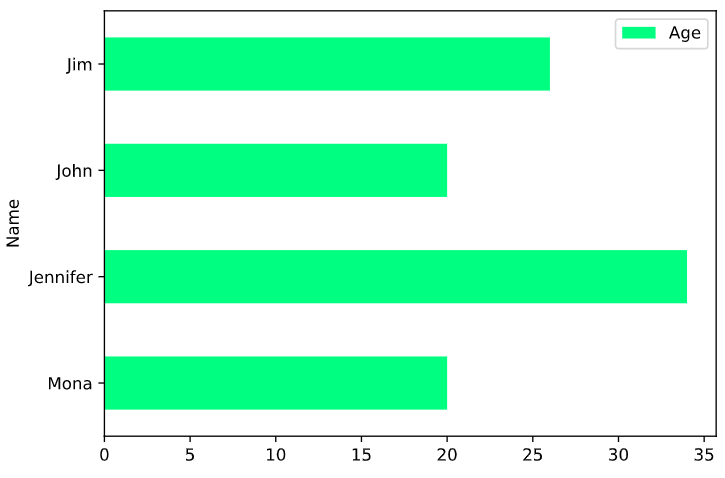

# pyspark教程

## SparkContext

### What is SparkContext

- SparkContext is an entry point into the world of Spark
- An entry point is a way of connecting to Spark cluster
- An entry point is like a key to the house
- PySpark has a default SparkContext called `sc`

#### 1.Linking with Spark

```python
from pyspark import SparkContext, SparkConf
```

#### 2.Initializing Spark

```python
# The first thing a Spark program must do is to create a SparkContext object
# which tells Spark how to access a cluster.

conf = SparkConf().setAppName(appName).setMaster(master)
sc = SparkContext(conf=conf)
# appName parameter is a name for your application to show on the cluster UI.
# master is a Spark, Mesos or YARN cluster URL, or a special “local” string to run in local mode.
```

#### 3.Use SparkContext

```python
# Version: To retrieve SparkContext version
sc.version ---> 2.3.1

# Python Version: To retrieve Python version of SparkContext
sc.pythonVer ---> 3.6

# Master: URL of the cluster or “local” string to run in local mode of SparkContext
sc.master ---> local[*]    # Run Spark locally with as many worker threads as logical cores on your machine.
```

#### *Lambda function in python*

```python
# 传统方法
def cube(x):
    return x ** 3
cube(10) ---> 1000

# Lambda
g = lambda x: x ** 3
g(10) ---> 1000
```

```python
# map(function, list)
items = [1, 2, 3, 4]
list(map( lambda x: x + 2 , items)) ---> [3, 4, 5, 6]
```

```python
# filter(function, list)
items = [1, 2, 3, 4]
list(filter( lambda x: (x%2 != 0), items)) ---> [1, 3]
```

**********************************************************

## RDD(Resilient Distributed Datasets)

### What is RDD

- Resilient: Ability to withstand failures
- Distributed: Spanning across multiple machines
- Datasets: Collection of partitioned data e.g, Arrays, Tables, Tuples etc.,

### How to creating RDDs

- Parallelizing an existing collection of objects
- External datasets:
  - Files in HDFS
  - Objects in Amazon S3 bucket
  - lines in a text file
- From existing RDDs

```python
# parallelize() method
numRDD = sc.parallelize([1,2,3,4,5], minPartitions = 2) # A partition is a logical division of a large distributed data set
type(numRDD) ---> <class 'pyspark.rdd.RDD'>
numRDD.getNumPartitions() ---> 2

helloRDD = sc.parallelize("Hello world")
type(helloRDD) ---> <class 'pyspark.rdd.PipelinedRDD'>
```

```python
# textFile() method
print("The file_path is", file_path)
---> The file_path is /usr/local/share/datasets/README.md

# Create a fileRDD from file_path
fileRDD = sc.textFile(file_path, minPartitions = 5)

# Check the type of fileRDD
print("The file type of fileRDD is", type(fileRDD))
---> The file type of fileRDD is <class 'pyspark.rdd.RDD'>

# Check the number of partitions in fileRDD_part
print("Number of partitions in fileRDD is", fileRDD.getNumPartitions())
---> Number of partitions in fileRDD is 5
```

### RDD Operations


#### Transformations create new RDDS


```python
# map() Transformation applies a function to all elements in the RDD
RDD = sc.parallelize([1,2,3,4])
RDD_map = RDD.map(lambda x: x * x)
```

```python
# flter() Transformation returns a new RDD with only the elements that pass the condition
RDD = sc.parallelize([1,2,3,4])
RDD_filter = RDD.filter(lambda x: x > 2)
```

```python
# fatMap() transformation returns multiple values for each element in the original RDD
RDD = sc.parallelize(["hello world", "how are you"])
RDD_flatmap = RDD.flatMap(lambda x: x.split(" "))
```

```python
# union() Transformation
inputRDD = sc.textFile("logs.txt")
errorRDD = inputRDD.filter(lambda x: "error" in x.split())
warningsRDD = inputRDD.filter(lambda x: "warnings" in x.split())
combinedRDD = errorRDD.union(warningsRDD)
```

#### Actions perform computation on the RDDs

```python
# collect()
RDD_map.collect() ---> [1, 4, 9, 16]
```

```python
# take(N)
RDD_filter.collect() ---> [3,4]
RDD_filter.take(1) ---> [3]
```

```python
# first()
RDD_flatmap.collect() ---> ['hello', 'world', 'how', 'are', 'you']
RDD_flatmap.first() ---> 'hello'
```

```python
# count()
RDD_flatmap.count() ---> 5
```

```python
# reduce(func)
RDD = sc.parallelize([1,3,4,6])
RDD.reduce( lambda x, y : x + y) ---> 14
```

```python
# save RDDs
# saveAsTextFile():saves RDD into a text ?le inside a directory with each partition as a separate file
RDD.saveAsTextFile("tempFile")

-----------------------------------------------
# coalesce():save RDD as a single text file
RDD.coalesce(1).saveAsTextFile("tempFile")
```

##### *pair RDD*

- Real life datasets are usually key/value pairs
- Each row is a key and maps to one or more values
- Pair RDD is a special data structure to work with this kind of datasets
- Pair RDD: Key is the identifer and value is data

##### *Creating pair RDDs*

***1. From a list of key-value tuple***

```python
my_tuple = [('Sam', 23), ('Mary', 34), ('Peter', 25)]
pairRDD_tuple = sc.parallelize(my_tuple)

-----------------------------------------------

my_list = ['Sam 23', 'Mary 34', 'Peter 25']
regularRDD = sc.parallelize(my_list)
pairRDD_RDD = regularRDD.map( lambda s: (s.split(' ')[0], s.split(' ')[1]))
```

***2. From a regular RDD***
......

##### *Transformations on pair RDDs*

- All regular transformations work on pair RDD(map,filter,flatmap,union)
- Have to pass functions that operate on key value pairs rather than on individual elements
- What's more...

```python
# reduceByKey(func): Combine values with the same key
regularRDD = sc.parallelize([("Messi", 23), ("Ronaldo", 34),("Neymar", 22), ("Messi", 24)])
pairRDD_reducebykey = regularRDD.reduceByKey( lambda x,y : x + y)

pairRDD_reducebykey.collect()
---> [('Neymar', 22), ('Ronaldo', 34), ('Messi', 47)]
```

```python
# sortByKey(): Return an RDD sorted by the key
pairRDD_reducebykey_rev = pairRDD_reducebykey.map( lambda x: (x[1], x[0]))

pairRDD_reducebykey_rev.sortByKey(ascending= False).collect()
---> [(47, 'Messi'), (34, 'Ronaldo'), (22, 'Neymar')]
```

```python
# groupByKey(): Group values with the same key
airports = [("US", "JFK"),("UK", "LHR"),("FR", "CDG"),("US", "SFO")]
regularRDD = sc.parallelize(airports)

pairRDD_group = regularRDD.groupByKey().collect()
for cont, air in pairRDD_group:
    print(cont, list(air))
--->
FR ['CDG']
US ['JFK', 'SFO']
UK ['LHR']
```

```python
# join(): Join two pair RDDs based on their key
RDD1 = sc.parallelize([("Messi", 34),("Ronaldo", 32),("Neymar", 24)])
RDD2 = sc.parallelize([("Ronaldo", 80),("Neymar", 120),("Messi", 100)])

RDD1.join(RDD2).collect()
---> [('Neymar', (24, 120)), ('Ronaldo', (32, 80)), ('Messi', (34, 100))]
```

##### *Actions on pair RDDs*

- RDD actions available for PySpark pair RDDs

```python
# countByKey()
rdd = sc.parallelize([("a", 1), ("b", 1), ("a", 1)])
for kee, val in rdd.countByKey().items():
    print(kee, val)
--->
('a', 2)
('b', 1)
```

```python
# collectAsMap():return the key-value pairs in the RDD as a dictionary
sc.parallelize([(1, 2), (3, 4)]).collectAsMap() ---> {1: 2, 3: 4}
```

**********************************************************

## SparkSession

### What is SparkSession

- SparkContext is the main entry point for creating RDDs
- SparkSession provides a single point of entry to interact with Spark DataFrames
- SparkContext --> RDDs   **VS**   SparkSession --> DataFrames
- SparkSession is used to create DataFrame, register DataFrames, execute SQL queries
- SparkSession is available in PySpark shell as `spark`

## DataFrames(Resilient Distributed Datasets)

### What is Pyspark DataFrames

- PySpark DataFrame is an immutable distributed collection of data with named columns
- Designed for processing both structured (e.g relational database) and semi-structured data (e.g JSON)
- DataFrames in PySpark support both SQL queries ( SELECT * from table ) or expression methods ( df.select() )
- PySpark SQL is a Spark library for structured data. It provides more information about the structure of data and computation

### How to creating DataFrames

- From existing RDDs using SparkSession's createDataFrame() method
- From various data sources (CSV, JSON, TXT) using SparkSession's read method

```python
# Create a list of tuples
sample_list = [('Mona',20), ('Jennifer',34),('John',20), ('Jim',26)]

# Create a RDD from the list
rdd = sc.parallelize(sample_list)

# Create a PySpark DataFrame
names_df = spark.createDataFrame(rdd, schema=['Name', 'Age'])

# Check the type of names_df
print(type(names_df))
--->
<class 'pyspark.sql.dataframe.DataFrame'>
```

```python
df_csv = spark.read.csv("people.csv", header= True, inferSchema= True)
```

```python
df_json = spark.read.json("people.json", header= True, inferSchema= True)
```

```python
df_txt = spark.read.txt("people.txt", header= True, inferSchema= True)
```

### DataFrames Operations

| \_c0 | person\_id | name             | sex    | date of birth |
|------|------------|------------------|--------|---------------|
| 0    | 100        | Penelope Lewis   | female | 1990\-08\-31  |
| 1    | 101        | David Anthony    | male   | 1971\-10\-14  |
| 2    | 102        | Ida Shipp        | female | 1962\-05\-24  |
| 3    | 103        | Joanna Moore     | female | 2017\-03\-10  |
| 4    | 104        | Lisandra Ortiz   | female | 2020\-08\-05  |
| 5    | 105        | David Simmons    | male   | 1999\-12\-30  |
| 6    | 106        | Edward Hudson    | male   | 1983\-05\-09  |
| 7    | 107        | Albert Jones     | male   | 1990\-09\-13  |
| 8    | 108        | Leonard Cavender | male   | 1958\-08\-08  |
| 9    | 109        | Everett Vadala   | male   | 2005\-05\-24  |

#### DataFrames Transformations

```python
# select()
people_df_name = people_df.select('name')
```

```python
# filter()
people_df_id = people_df.filter(people_df.person_id > 105)
```

```python
# groupby()
people_df_sex_group = people_df.groupby('sex')
```

```python
# orderby()
people_df_order = people_df.orderBy('person_id')
```

```python
# dropDuplicates()
people_df_dup = people_df.select('date of birth','sex').dropDuplicates()
```

```python
# withColumnRenamed(): renames a column in the DataFrame
people_df_Gender = people_df.withColumnRenamed('Sex'，'Gender')
```

#### DataFrames Actions

```python
# printSchema()
people_df.printSchema()
--->
root
 |-- _c0: integer (nullable = true)
 |-- person_id: integer (nullable = true)
 |-- name: string (nullable = true)
 |-- sex: string (nullable = true)
 |-- date of birth: string (nullable = true)
```

```python
# show(): prints first 20/n rows in the DataFrame
# vs RDD's collect() / take()
people_df_name.show(5)
--->
+--------------+
|          name|
+--------------+
|Penelope Lewis|
| David Anthony|
|     Ida Shipp|
|  Joanna Moore|
|Lisandra Ortiz|
+--------------+
only showing top 5 rows
```

```python
# head()
people_df_id.head(3)
--->
[
 Row(_c0=6, person_id=106, name='Edward Hudson', sex='male', date of birth='1983-05-09'),
 Row(_c0=7, person_id=107, name='Albert Jones', sex='male', date of birth='1990-09-13'),
 Row(_c0=8, person_id=108, name='Leonard Cavender', sex='male', date of birth='1958-08-08')
]
```

```python
# count()
people_df_sex_group.count().show()
--->
+------+-----+
|   sex|count|
+------+-----+
|  null| 1920|
|female|49014|
|  male|49066|
+------+-----+
```

```python
# columns()
people_df.columns
--->
['_c0', 'person_id', 'name', 'sex', 'date of birth']
```

```python
# describe()
people_df.describe().show()
--->
+-------+-----------------+-----------------+-------------+------+-------------+
|summary|              _c0|        person_id|         name|   sex|date of birth|
+-------+-----------------+-----------------+-------------+------+-------------+
|  count|           100000|           100000|       100000| 98080|       100000|
|   mean|          49999.5|          50099.5|         null|  null|         null|
| stddev|28867.65779668774|28867.65779668774|         null|  null|         null|
|    min|                0|              100|Aaron Addesso|female|   1899-08-28|
|    max|            99999|           100099|  Zulma Biggs|  male|   2084-11-17|
+-------+-----------------+-----------------+-------------+------+-------------+
```

#### *DataFrame SQL queries*

- SQL queries can be concise and easier to understand and portable
- The operations on DataFrames can also be done using SQL queries

```python
# Create a temporary table "people"
people_df.createOrReplaceTempView("people")

# Construct a query to select the names of the people from the temporary table "people"
query = '''SELECT name FROM people'''

# Assign the result of Spark's query to people_df_names
people_df_names = spark.sql(query)

# Print the top 10 names of the people
people_df_names.show(10)
--->
+----------------+
|            name|
+----------------+
|  Penelope Lewis|
|   David Anthony|
|       Ida Shipp|
|    Joanna Moore|
|  Lisandra Ortiz|
|   David Simmons|
|   Edward Hudson|
|    Albert Jones|
|Leonard Cavender|
|  Everett Vadala|
+----------------+
only showing top 10 rows
```

**********************************************************

## Data visualization

- Plotting graphs using PySpark DataFrames is done using three methods
  - pyspark_dist_explore library
  - toPandas()  ---> **Recommend**
  - HandySpark library

### Using Pandas for plotting DataFrames

| Name     | Age |
|----------|-----|
| Mona     | 20  |
| Jennifer | 34  |
| John     | 20  |
| Jim      | 26  |

```python
# Convert to Pandas DataFrame  
df_pandas = names_df.toPandas()

# Create a horizontal bar plot
df_pandas.plot(kind='barh', x='Name', y='Age', colormap='winter_r')
plt.show()
```



***End.***
