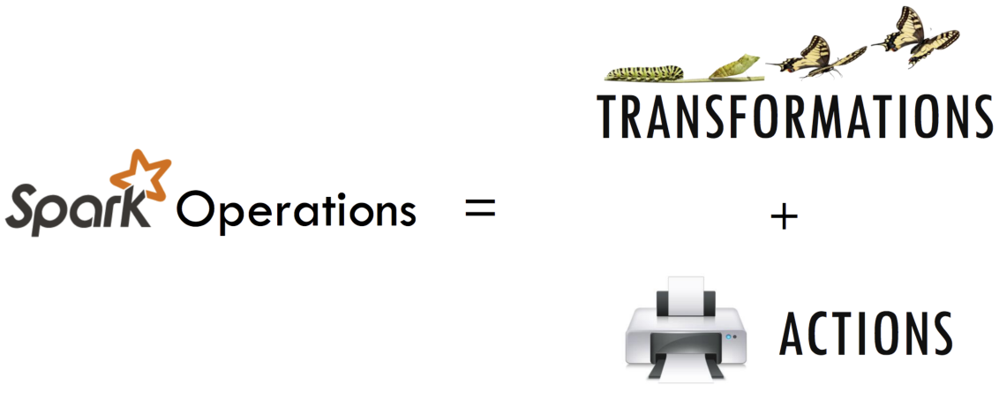
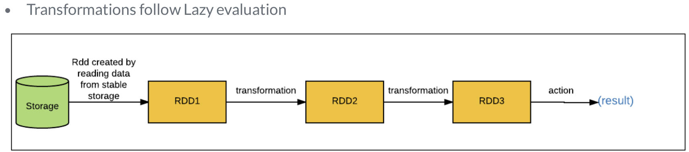

<!--
 * @Date: 2019-11-28 15:05:53
 * @Author: YING
 * @LastEditTime: 2019-11-28 17:55:06
 -->
 
# pyspark教程

## SparkContext

### What is SparkContext

- SparkContext is an entry point into the world of Spark
- An entry point is a way of connecting to Spark cluster
- An entry point is like a key to the house
- PySpark has a default SparkContext called `sc`

#### 1.Linking with Spark

```python
from pyspark import SparkContext, SparkConf
```

#### 2.Initializing Spark

```python
# The first thing a Spark program must do is to create a SparkContext object
# which tells Spark how to access a cluster.

conf = SparkConf().setAppName(appName).setMaster(master)
sc = SparkContext(conf=conf)
# appName parameter is a name for your application to show on the cluster UI.
# master is a Spark, Mesos or YARN cluster URL, or a special “local” string to run in local mode.
```

#### 3.Use SparkContext

```python
# Version: To retrieve SparkContext version
sc.version ---> 2.3.1

# Python Version: To retrieve Python version of SparkContext
sc.pythonVer ---> 3.6

# Master: URL of the cluster or “local” string to run in local mode of SparkContext
sc.master ---> local[*]    # Run Spark locally with as many worker threads as logical cores on your machine.
```

#### *Lambda function in python*

```python
# 传统方法
def cube(x):
    return x ** 3
cube(10) ---> 1000

# Lambda
g = lambda x: x ** 3
g(10) ---> 1000
```

```python
# map(function, list)
items = [1, 2, 3, 4]
list(map( lambda x: x + 2 , items)) ---> [3, 4, 5, 6]
```

```python
# filter(function, list)
items = [1, 2, 3, 4]
list(filter( lambda x: (x%2 != 0), items)) ---> [1, 3]
```

**********************************************************

## RDD(Resilient Distributed Datasets)

### What is RDD

- Resilient: Ability to withstand failures
- Distributed: Spanning across multiple machines
- Datasets: Collection of partitioned data e.g, Arrays, Tables, Tuples etc.,

### How to creating RDDs

- Parallelizing an existing collection of objects
- External datasets:
  - Files in HDFS
  - Objects in Amazon S3 bucket
  - lines in a text file
- From existing RDDs

```python
# parallelize() method
numRDD = sc.parallelize([1,2,3,4,5], minPartitions = 2) # A partition is a logical division of a large distributed data set
type(numRDD) ---> <class 'pyspark.rdd.RDD'>
numRDD.getNumPartitions() ---> 2

helloRDD = sc.parallelize("Hello world")
type(helloRDD) ---> <class 'pyspark.rdd.PipelinedRDD'>
```

```python
# textFile() method
print("The file_path is", file_path)
---> The file_path is /usr/local/share/datasets/README.md

# Create a fileRDD from file_path
fileRDD = sc.textFile(file_path, minPartitions = 5)

# Check the type of fileRDD
print("The file type of fileRDD is", type(fileRDD))
---> The file type of fileRDD is <class 'pyspark.rdd.RDD'>

# Check the number of partitions in fileRDD_part
print("Number of partitions in fileRDD is", fileRDD.getNumPartitions())
---> Number of partitions in fileRDD is 5
```

### RDD Operations



#### Transformations create new RDDS



```python
# map() Transformation applies a function to all elements in the RDD
RDD = sc.parallelize([1,2,3,4])
RDD_map = RDD.map(lambda x: x * x)
```

```python
# flter() Transformation returns a new RDD with only the elements that pass the condition
RDD = sc.parallelize([1,2,3,4])
RDD_filter = RDD.filter(lambda x: x > 2)
```

```python
# fatMap() transformation returns multiple values for each element in the original RDD
RDD = sc.parallelize(["hello world", "how are you"])
RDD_flatmap = RDD.flatMap(lambda x: x.split(" "))
```

```python
# union() Transformation
inputRDD = sc.textFile("logs.txt")
errorRDD = inputRDD.filter(lambda x: "error" in x.split())
warningsRDD = inputRDD.filter(lambda x: "warnings" in x.split())
combinedRDD = errorRDD.union(warningsRDD)
```

#### Actions perform computation on the RDDs

```python
# collect()
RDD_map.collect() ---> [1, 4, 9, 16]
```

```python
# take(N)
RDD_filter.collect() ---> [3,4]
RDD_filter.take(1) ---> [3]
```

```python
# first()
RDD_flatmap.collect() ---> ['hello', 'world', 'how', 'are', 'you']
RDD_flatmap.first() ---> 'hello'
```

```python
# count()
RDD_flatmap.count() ---> 5
```

```python
# reduce(func)
RDD = sc.parallelize([1,3,4,6])
RDD.reduce( lambda x, y : x + y) ---> 14
```

```python
# save RDDs
# saveAsTextFile():saves RDD into a text ?le inside a directory with each partition as a separate file
RDD.saveAsTextFile("tempFile")

-----------------------------------------------
# coalesce():save RDD as a single text file
RDD.coalesce(1).saveAsTextFile("tempFile")
```

##### *pair RDD*

- Real life datasets are usually key/value pairs
- Each row is a key and maps to one or more values
- Pair RDD is a special data structure to work with this kind of datasets
- Pair RDD: Key is the identifer and value is data

##### *Creating pair RDDs*

***1. From a list of key-value tuple***

```python
my_tuple = [('Sam', 23), ('Mary', 34), ('Peter', 25)]
pairRDD_tuple = sc.parallelize(my_tuple)

-----------------------------------------------

my_list = ['Sam 23', 'Mary 34', 'Peter 25']
regularRDD = sc.parallelize(my_list)
pairRDD_RDD = regularRDD.map( lambda s: (s.split(' ')[0], s.split(' ')[1]))
```

***2. From a regular RDD***
......

##### *Transformations on pair RDDs*

- All regular transformations work on pair RDD(map,filter,flatmap,union)
- Have to pass functions that operate on key value pairs rather than on individual elements
- What's more...

```python
# reduceByKey(func): Combine values with the same key
regularRDD = sc.parallelize([("Messi", 23), ("Ronaldo", 34),("Neymar", 22), ("Messi", 24)])
pairRDD_reducebykey = regularRDD.reduceByKey( lambda x,y : x + y)

pairRDD_reducebykey.collect()
---> [('Neymar', 22), ('Ronaldo', 34), ('Messi', 47)]
```

```python
# groupByKey(): Group values with the same key
pairRDD_reducebykey_rev = pairRDD_reducebykey.map( lambda x: (x[1], x[0]))

pairRDD_reducebykey_rev.sortByKey(ascending= False).collect()
---> [(47, 'Messi'), (34, 'Ronaldo'), (22, 'Neymar')]
```

```python
# sortByKey(): Return an RDD sorted by the key
airports = [("US", "JFK"),("UK", "LHR"),("FR", "CDG"),("US", "SFO")]
regularRDD = sc.parallelize(airports)

pairRDD_group = regularRDD.groupByKey().collect()
for cont, air in pairRDD_group:
    print(cont, list(air))
--->
FR ['CDG']
US ['JFK', 'SFO']
UK ['LHR']
```

```python
# join(): Join two pair RDDs based on their key
RDD1 = sc.parallelize([("Messi", 34),("Ronaldo", 32),("Neymar", 24)])
RDD2 = sc.parallelize([("Ronaldo", 80),("Neymar", 120),("Messi", 100)])

RDD1.join(RDD2).collect()
---> [('Neymar', (24, 120)), ('Ronaldo', (32, 80)), ('Messi', (34, 100))]
```

##### *Actions on pair RDDs*

```python
# countByKey()
rdd = sc.parallelize([("a", 1), ("b", 1), ("a", 1)])
for kee, val in rdd.countByKey().items():
    print(kee, val)
--->
('a', 2)
('b', 1)
```

```python
# collectAsMap():return the key-value pairs in the RDD as a dictionary
sc.parallelize([(1, 2), (3, 4)]).collectAsMap() ---> {1: 2, 3: 4}
```

**********************************************************


```python

```

```python

```

```python

```

```python

```

```python

```

```python

```